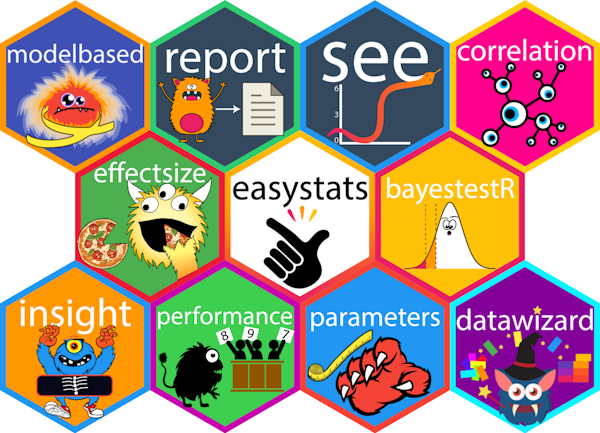
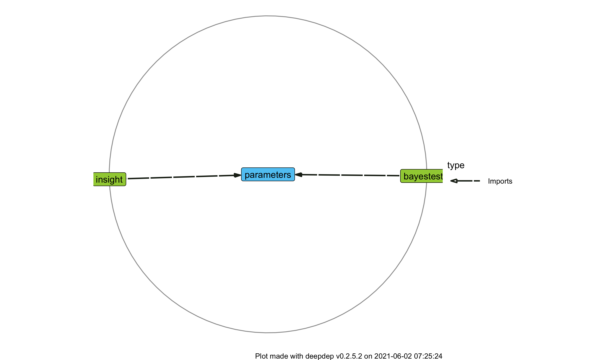
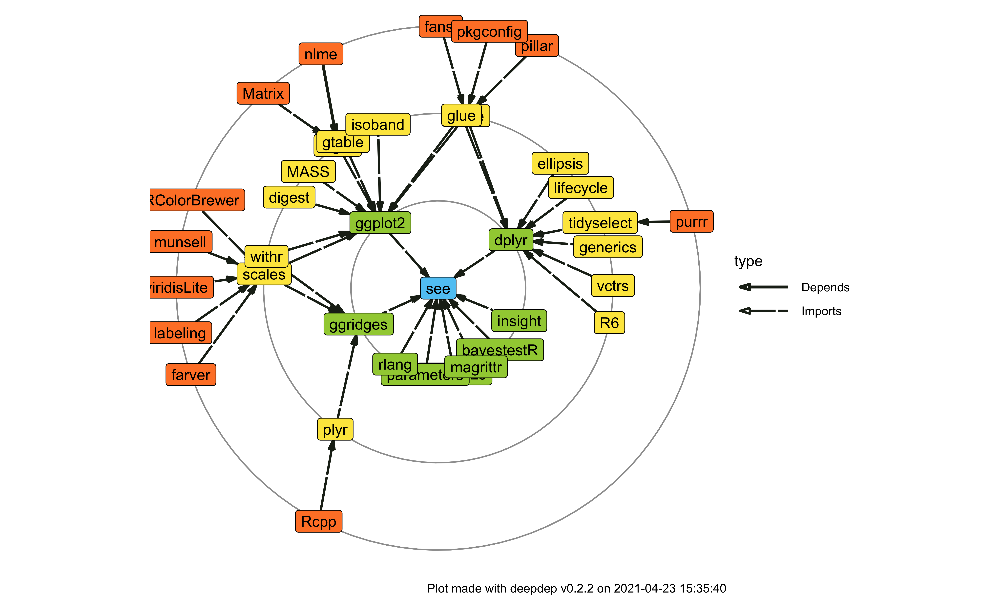
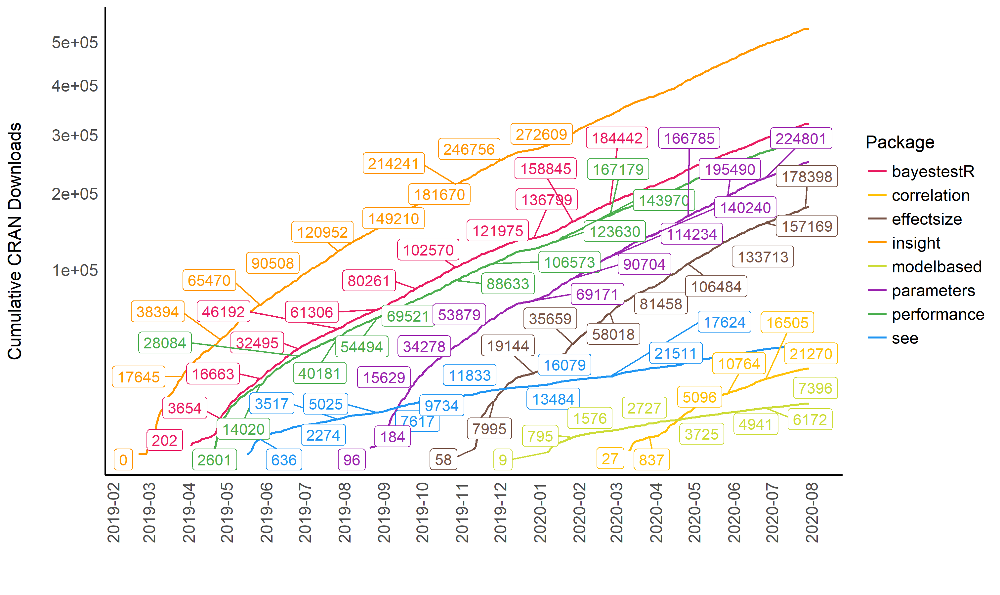
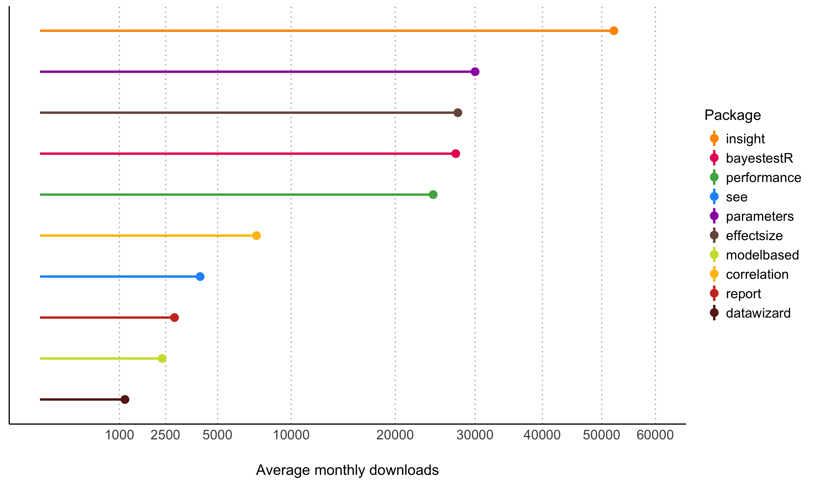
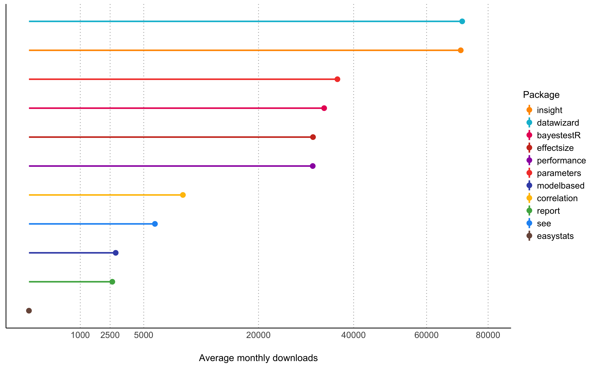

# *easystats*: Jump in the Easyverse

# What is *easystats*?

**easystats** is a collection of R packages, which aims to provide a
unifying and consistent framework to tame, discipline, and harness the
scary R statistics and their pesky models.

However, there is not (yet) an *unique* “easystats” way of doing data
analysis. Instead, start with one package and, when you’ll face a new
challenge, do check if there is an *easystats* answer for it in other
packages. You will slowly uncover how using them together facilitates
your life. And, who knows, you might even end up using them all.
***Gotta catch ’em all\!*** <!--
'tis a pokémon reference for y'all grandpas -->



# Installation

The whole `easystats` suite can be installed *at once* with the
following:

``` r
install.packages("easystats", repos = "https://easystats.r-universe.dev")
```

You can then load the entire ecosystem by running:

``` r
library("easystats")
```

The package is currently not available on CRAN, but we are working on
submitting it there soon.

Finally, as *easystats* sometimes depends on some additional packages
for specific functions that are not downloaded by default. If you want
to benefit from the **full *easystats* experience** without any hiccups,
simply run the following:

``` r
easystats::install_suggested()
```

# Citation

Do you wish to cite *easystats*? ❤️

Have a look at this article on how you can do so\!
<https://easystats.github.io/easystats/articles/resources.html>

# Getting started

Each **easystats** package has a different scope and purpose. This means
your **best way to start** is to explore and pick the one(s) that you
feel might be useful to you. However, as they are built with a “bigger
picture” in mind, you will realize that using more of them creates a
smooth workflow, as these packages are meant to work together. Ideally,
these packages work in unison to cover all aspects of statistical
analysis and data visualization.

  - [**report**](https://github.com/easystats/report): 📜 🎉 Automated
    statistical reporting of objects in R
  - [**correlation**](https://github.com/easystats/correlation): 🔗 Your
    all-in-one package to run correlations
  - [**modelbased**](https://github.com/easystats/modelbased): 📈
    Estimate effects, group averages and contrasts between groups based
    on statistical models
  - [**bayestestR**](https://github.com/easystats/bayestestR): 👻 Great
    for beginners or experts of Bayesian statistics
  - [**parameters**](https://github.com/easystats/parameters): 📊 Obtain
    a table containing all information about the parameters of your
    models
  - [**performance**](https://github.com/easystats/performance): 💪
    Models’ quality and performance metrics (R2, ICC, LOO, AIC, BF, …)
  - [**effectsize**](https://github.com/easystats/effectsize): 🐉
    Compute, convert, interpret and work with indices of effect size and
    standardized parameters
  - [**insight**](https://github.com/easystats/insight): 🔮 For
    developers, a package to help you work with different models and
    packages
  - [**see**](https://github.com/easystats/see): 🎨 The plotting
    companion to create beautiful results visualizations
  - [**datawizard**](https://github.com/easystats/datawizard): 🧙 Magic
    potions to clean and transform your data

# Frequently Asked Questions

**How is *easystats* different from the *tidyverse*?**

You’ve probably already heard about the
[**tidyverse**](https://www.tidyverse.org/), another very popular
collection of packages (*ggplot*, *dplyr*, *tidyr*, …) that also makes
using R easier. So, should you pick the *tidyverse* or *easystats*?
**Pick both\!**

Indeed, these two ecosystems have been designed with very different
goals in mind. The *tidyverse* packages are primarily made to create a
new R experience, where data manipulation and exploration is intuitive
and consistent. On the other hand, **easystats** focuses more on the
final stretch of the analysis: understanding and interpreting your
results and reporting them in a manuscript or a report, while following
best practices. You can definitely use the *easystats* functions in a
*tidyverse* workflow\!

> **easystats + tidyverse =** ❤️

**Can *easystats* be useful to advanced users and/or developers?**

Yes, definitely\! **easystats** is built in terms of modules that are
general enough to be used inside other packages. For instance, the
*insight* package is made to easily implement support for
post-processing of pretty much all regression model packages under the
sun. We use it in all the *easystats* packages, but it is also used in
other non-easystats packages, such as
[**ggstatsplot**](https://github.com/IndrajeetPatil/ggstatsplot),
[**modelsummary**](https://github.com/vincentarelbundock/modelsummary/),
[**ggeffects**](https://github.com/strengejacke/ggeffects), and more.

**So why not in yours**?

Moreover, the *easystats* packages are very lightweight, with a minimal
set of dependencies, which again makes it great if you want to rely on
them.

# Documentation

## Websites

Each `easystats` package has a dedicated website.

For example, website for `parameters` is
<https://easystats.github.io/parameters/>.

## Blog

In addition to the websites containing documentation for these packages,
you can also read posts from `easystats` blog:
<https://easystats.github.io/blog/posts/>.

## Other learning resources

In addition to these websites and blog posts, you can also check out the
following presentations and talks to learn more about this ecosystem:

<https://easystats.github.io/easystats/articles/resources.html>

# Dependencies

Most *easystats* packages are very lightweight, *i.e.*, they don’t rely
nor import any other packages\! This means that you can safely use them
as dependencies in your own packages, without the risk of a butterfly
effect, where a small change in a distant downstream dependency with
unexpected upstream consequences.

For example, the `parameters` package only relies on two other packages.

<!-- -->

<!-- TODO: uncomment once on CRAN -->

<!-- ```{r depnetwork_easystats} -->

<!-- library(deepdep) -->

<!-- plot_dependencies("easystats", depth = 3) -->

<!-- ``` -->

**There is one exception**\!

The [**see**](http://easystats.github.io/see) package is one of our
high-level packages that is responsible for plotting and creating
figures, relying thus on other packages such as *ggplot2*, which has a
substantial number of dependencies.

<!-- -->

# Downloads

| Total     | insight   | bayestestR | parameters | performance | effectsize | correlation | see     | datawizard | modelbased | report |
| :-------- | :-------- | :--------- | :--------- | :---------- | :--------- | :---------- | :------ | :--------- | :--------- | :----- |
| 4,855,412 | 1,598,448 | 805,914    | 743,492    | 711,506     | 595,265    | 135,115     | 123,709 | 81,678     | 50,804     | 9,481  |

### Trend



### Cumulative downloads



### Average monthly downloads



# Versioning

Package version numbers indicate following:
`MAJOR.MINOR.PATCH.DEVELOPMENT`. Here are key steps to keep in mind:

  - As long as packages are in a more or less rapidly developing and
    changing state, the **major** version number is typically `0`.

  - Once we think we will have a stable base that will likely not change
    dramatically or soon, the major version number will be set to `1`,
    and will be increased for following major changes that probably
    break the current API.

  - When new features are added or (re)moved, we typically increase the
    **minor** version number.

  - Minimal changes or bug fixes only are indicated by increasing the
    **patch** version number.

  - Current development versions of our packages (i.e. master/main
    branch from GitHub) additionally have a **development** version
    number.

# Contributing

We are happy to receive bug reports, suggestions, questions, and (most
of all) contributions to fix problems and add features. Pull Requests
for contributions are encouraged.

Here are some simple ways in which you can contribute (in the increasing
order of commitment):

  - Read and correct any inconsistencies in the documentation
  - Raise issues about bugs or wanted features
  - Review code
  - Add new functionality

# Code of Conduct

Please note that the ‘easystats’ project is released with a [Contributor
Code of
Conduct](https://contributor-covenant.org/version/2/0/CODE_OF_CONDUCT.html).
By contributing to this project, you agree to abide by its terms.
