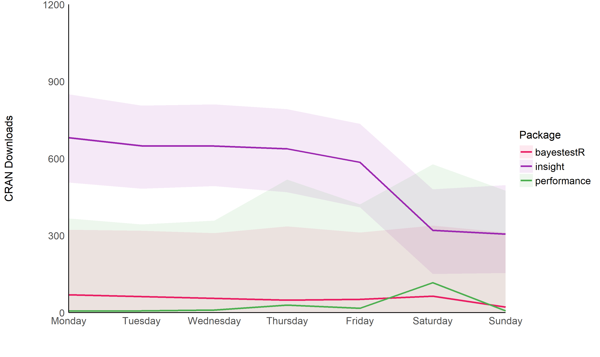
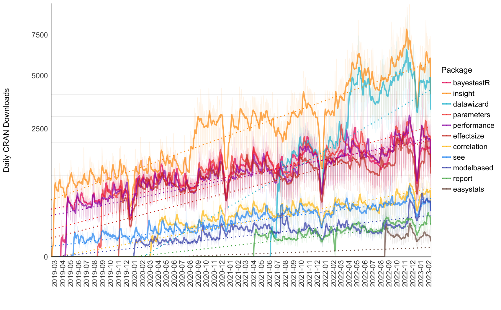

# easystats

<p>

<a href = "https://github.com/easystats/insight"></a>
<a href = "https://github.com/easystats/bayestestR"></a>
<a href = "https://github.com/easystats/parameters"></a>
<a href = "https://github.com/easystats/performance"></a>
<a href = "https://github.com/easystats/effectsize"></a>
<a href = "https://github.com/easystats/modelbased"></a>
<a href = "https://github.com/easystats/correlation"></a>
<a href = "https://github.com/easystats/see"></a>
<a href = "https://github.com/easystats/report"></a>

</p>

The aim of **easystats** is to provide a unifying and consistent
framework to tame, discipline and harness the scary R statistics and
their pesky models.

# Installation

The whole `easystats` suite can be installed *at once* with the
following:

``` r
install.packages("devtools")
devtools::install_github("easystats/easystats")
```

``` r
library("easystats")
```

# Features

  - [Comparison of indices of significance in the Bayesian
    framework](https://easystats.github.io/blog/posts/bayestestr_evidence_ani/)
  - [News from easystats: updated parameters and see
    packages](https://easystats.github.io/blog/posts/parameters_and_see_update/)
  - [parameters: a powerful and lightweight alternative to broom to
    describe your models’
    coefficients](https://easystats.github.io/blog/posts/parameters_presentation/)
  - [Check your (Mixed) Model for Multicollinearity with
    ‘performance’](https://easystats.github.io/blog/posts/performance_check_collinearity/)
  - [Testing Contrasts from Bayesian Models with ‘emmeans’ and
    ‘bayestestR’](https://easystats.github.io/blog/posts/bayestestr_emmeans/)
  - [Become a Bayesian master with bayestestR
    (0.2)](https://easystats.github.io/blog/posts/bayestestr_v2/)
  - [The ‘see’ package: beautiful figures for
    easystats](https://easystats.github.io/blog/posts/see_presentation/)
  - [Compute R2s and other performance indices for all your
    models\!](https://easystats.github.io/blog/posts/performance_presentation/)
  - [Describe and understand Bayesian models and posteriors using
    bayestestR](https://easystats.github.io/blog/posts/bayestestr_presentation/)
  - [A unified syntax for accessing models’
    information](https://easystats.github.io/blog/posts/insight_presentation/)
  - [The end of errors in ANOVA
    reporting](https://easystats.github.io/blog/posts/report_anova/)

Find an overview of all postings
[here](https://easystats.github.io/blog/posts/).

# Dependencies

Most of *easystats* packages are very lightweight, *i.e.*, they don’t
rely nor import any other packages\! This means that you can safely use
them as dependencies in your own packages, without the risk of butterfly
effects (a small change in a distant downstream dependency with
unexpected upstream consequences).

There is one exception. The [**see**](http://easystats.github.io/see)
package is one of our high-level packages that is responsible for
plotting and creating figures, relying thus on other packages such as
*ggplot2*, which itself is plugged in the *tidyverse*, increasing
package dependencies by a substantial amount. On the bright side of
things, it gives a good **overview of the place of *easystats* in the R
ecosystem**.

# Citation

How to reference *easystats*?

1.  **Cite specific packages**

The most parsimonious approach is to cite only the particular package
that helped you, e.g., “using *bayestestR* (Makowski, Ben-Shachar, &
Lüdecke, 2019)”. However, as *easystats* is meant to be an ecosystem,
with different people working on its different aspects (some being more
“citeable” than others), please consider including also the “main”
publication: [***not available
yet***](https://github.com/easystats/easystats/issues/24).

2.  **Cite the whole ecosystem**

Want to really help us boost our *h*-index? Or simply credit the whole
network of interconnected aspects of *easystats*? This can be done with
a sentence like the following:

> **Data processing was carried out with R (R Core Team, 2019) and the
> *easystats* ecosystem (Lüdecke, Waggoner, & Makowski, 2019; Makowski,
> Ben-Shachar, & Lüdecke, 2019)**

The corresponding *bibtex* entries are the following:

    @article{ludecke2019insight,
        journal = {Journal of Open Source Software},
        doi = {10.21105/joss.01412},
        issn = {2475-9066},
        number = {38},
        publisher = {The Open Journal},
        title = {insight: A Unified Interface to Access Information from Model Objects in R},
        url = {http://dx.doi.org/10.21105/joss.01412},
        volume = {4},
        author = {Lüdecke, Daniel and Waggoner, Philip and Makowski, Dominique},
        pages = {1412},
        date = {2019-06-25},
        year = {2019},
        month = {6},
        day = {25},
    }
    
    
    @article{makowski2019bayestestr,
        title = {{bayestestR}: {Describing} {Effects} and their {Uncertainty}, {Existence} and {Significance} within the {Bayesian} {Framework}},
        volume = {4},
        issn = {2475-9066},
        shorttitle = {{bayestestR}},
        url = {https://joss.theoj.org/papers/10.21105/joss.01541},
        doi = {10.21105/joss.01541},
        number = {40},
        urldate = {2019-08-13},
        journal = {Journal of Open Source Software},
        author = {Makowski, Dominique and Ben-Shachar, Mattan and Lüdecke, Daniel},
        month = aug,
        year = {2019},
        pages = {1541}
    }

# Versioning

Package version numbers indicate following:
`MAJOR.MINOR.PATCH.DEVELOPMENT`. As long as packages are in a more or
less rapidly developing and changig state, the **major** version number
is typically `0`. Once we think we will have a stable base that will
likely not change dramatically or soon, the major version number will be
set to `1`, and increased for following major changes that probably
break the current API. When new features are added or (re)moved, we
typicaly increase the **minor** version number. Minimal changes or bug
fixes only are indicated by increasing the **patch** version number.
Current development versions of our poackages (i.e. master branchs from
GitHub) additionally have a **development** version number. You
typically won’t find packages on CRAN with a development version number.

# Downloads

### Trend



### Cumulative downloads



<!--

Currently not working...

### By Week Day

-->

# Convention of code-style

Following conventions apply to the easystats-ecosystem, to ensure that
function and argument names as well as element names for return-values
follow a consistent pattern across all packages.

**Importing other packages**

  - No full import, only selective import of functions
  - Use base-R wherever possible (reduce dependencies)
  - Make sure R-version requirements are not too strict

**Helper-functions**

  - Own re-implementation of helper-functions, if it’s not too much
    effort (e.g. I typically use own functions to check if a string
    starts / ends with a pattern, or if an object (list, data frame)
    contains an element with a given name (like `tibble::has_name()`),
    to reduce dependencies.

**Function names**

  - Lower case, underscore separated if more than one verb
  - Common prefix for functions that focus on specific “tasks” or
    workflows (e.g. **insight**, `get_*()` to get data, `find_*()` to
    find information, or **performance**, `performance_*()` to compute
    measures of model quality, `check_*()` to check model assumptions…)
  - Internal functions (that are not exported, like the previously
    mentined helper-functions) should always start with a `.` (e.g.,
    `.do_some_internal_stuff()`).

**Argument names**

  - lower case, underscore separated if more than one verb

**Element / Column names** (for returned data frames)

1)  First letter of the column name is capital, unless (6) applies
    (*example:* `Parameter`)
2)  First letter of nouns is capital, unless (6) applies (*example:*
    `ROPE_Percentage`, `Prior_Scale`)
3)  Using underscore rather than camelCase to separate words (*example:*
    `CI_high`)
4)  Multiple words: common/main part first and
    adjective/specifier/variational part after (*example:*
    `Median_standardized`, `ROPE_percentage`)
5)  Abbreviations: all uppercase (*example:* `ESS`, `MCSE`, `ROPE`)
6)  Keep conventions for reserved words (*example:* `p`, `pd`, `Rhat`)
7)  Adjectives / verbs: all lower case, unless (1) applies (*example:*
    `high` or `low` in `CI_high` or `CI_low`)

# List of functions

  - [**`%>%`**](https://easystats.github.io/see/reference/index.html)
    *(see)*
  - [**`add_plot_attributes`**](https://easystats.github.io/see/reference/index.html)
    *(see)*
  - [**`adjust`**](https://easystats.github.io/effectsize/reference/index.html)
    *(effectsize)*
  - [**`all_models_equal`**](https://easystats.github.io/insight/reference/index.html)
    *(insight)*
  - [**`all_models_same_class`**](https://easystats.github.io/insight/reference/index.html)
    *(insight)*
  - [**`area_under_curve`**](https://easystats.github.io/bayestestR/reference/index.html)
    *(bayestestR)*
  - [**`as.numeric_ifnumeric`**](https://easystats.github.io/modelbased/reference/index.html)
    *(modelbased)*
  - [**`as.report`**](https://easystats.github.io/report/reference/index.html)
    *(report)*
  - [**`auc`**](https://easystats.github.io/bayestestR/reference/index.html)
    *(bayestestR)*
  - [**`bayesfactor_inclusion`**](https://easystats.github.io/bayestestR/reference/index.html)
    *(bayestestR)*
  - [**`bayesfactor_models`**](https://easystats.github.io/bayestestR/reference/index.html)
    *(bayestestR)*
  - [**`bayesfactor_parameters`**](https://easystats.github.io/bayestestR/reference/index.html)
    *(bayestestR)*
  - [**`bayesfactor_pointull`**](https://easystats.github.io/bayestestR/reference/index.html)
    *(bayestestR)*
  - [**`bayesfactor_restricted`**](https://easystats.github.io/bayestestR/reference/index.html)
    *(bayestestR)*
  - [**`bayesfactor_rope`**](https://easystats.github.io/bayestestR/reference/index.html)
    *(bayestestR)*
  - [**`bayesfactor`**](https://easystats.github.io/bayestestR/reference/index.html)
    *(bayestestR)*
  - [**`bayesian_as_frequentist`**](https://easystats.github.io/bayestestR/reference/index.html)
    *(bayestestR)*
  - [**`bf_inclusion`**](https://easystats.github.io/bayestestR/reference/index.html)
    *(bayestestR)*
  - [**`bf_models`**](https://easystats.github.io/bayestestR/reference/index.html)
    *(bayestestR)*
  - [**`bf_parameters`**](https://easystats.github.io/bayestestR/reference/index.html)
    *(bayestestR)*
  - [**`bf_pointull`**](https://easystats.github.io/bayestestR/reference/index.html)
    *(bayestestR)*
  - [**`bf_restricted`**](https://easystats.github.io/bayestestR/reference/index.html)
    *(bayestestR)*
  - [**`bf_rope`**](https://easystats.github.io/bayestestR/reference/index.html)
    *(bayestestR)*
  - [**`binned_residuals`**](https://easystats.github.io/performance/reference/index.html)
    *(performance)*
  - [**`bootstrap_model`**](https://easystats.github.io/parameters/reference/index.html)
    *(parameters)*
  - [**`bootstrap_parameters`**](https://easystats.github.io/parameters/reference/index.html)
    *(parameters)*
  - [**`change_scale`**](https://easystats.github.io/effectsize/reference/index.html)
    *(effectsize)*
  - [**`check_autocorrelation`**](https://easystats.github.io/performance/reference/index.html)
    *(performance)*
  - [**`check_clusterstructure`**](https://easystats.github.io/parameters/reference/index.html)
    *(parameters)*
  - [**`check_collinearity`**](https://easystats.github.io/performance/reference/index.html)
    *(performance)*
  - [**`check_convergence`**](https://easystats.github.io/performance/reference/index.html)
    *(performance)*
  - [**`check_distribution`**](https://easystats.github.io/performance/reference/index.html)
    *(performance)*
  - [**`check_factorstructure`**](https://easystats.github.io/parameters/reference/index.html)
    *(parameters)*
  - [**`check_heteroscedasticity`**](https://easystats.github.io/performance/reference/index.html)
    *(performance)*
  - [**`check_homogeneity`**](https://easystats.github.io/performance/reference/index.html)
    *(performance)*
  - [**`check_itemscale`**](https://easystats.github.io/performance/reference/index.html)
    *(performance)*
  - [**`check_kmo`**](https://easystats.github.io/parameters/reference/index.html)
    *(parameters)*
  - [**`check_model`**](https://easystats.github.io/performance/reference/index.html)
    *(performance)*
  - [**`check_multimodal`**](https://easystats.github.io/parameters/reference/index.html)
    *(parameters)*
  - [**`check_normality`**](https://easystats.github.io/performance/reference/index.html)
    *(performance)*
  - [**`check_outliers`**](https://easystats.github.io/performance/reference/index.html)
    *(performance)*
  - [**`check_overdispersion`**](https://easystats.github.io/performance/reference/index.html)
    *(performance)*
  - [**`check_prior`**](https://easystats.github.io/bayestestR/reference/index.html)
    *(bayestestR)*
  - [**`check_singularity`**](https://easystats.github.io/performance/reference/index.html)
    *(performance)*
  - [**`check_sphericity`**](https://easystats.github.io/parameters/reference/index.html)
    *(parameters)*
  - [**`check_zeroinflation`**](https://easystats.github.io/performance/reference/index.html)
    *(performance)*
  - [**`chisq_to_cramers_v`**](https://easystats.github.io/effectsize/reference/index.html)
    *(effectsize)*
  - [**`chisq_to_phi`**](https://easystats.github.io/effectsize/reference/index.html)
    *(effectsize)*
  - [**`ci_betwithin`**](https://easystats.github.io/parameters/reference/index.html)
    *(parameters)*
  - [**`ci_kenward`**](https://easystats.github.io/parameters/reference/index.html)
    *(parameters)*
  - [**`ci_ml1`**](https://easystats.github.io/parameters/reference/index.html)
    *(parameters)*
  - [**`ci_robust`**](https://easystats.github.io/parameters/reference/index.html)
    *(parameters)*
  - [**`ci_satterthwaite`**](https://easystats.github.io/parameters/reference/index.html)
    *(parameters)*
  - [**`ci_wald`**](https://easystats.github.io/parameters/reference/index.html)
    *(parameters)*
  - [**`ci`**](https://easystats.github.io/bayestestR/reference/index.html)
    *(bayestestR)*
  - [**`cite_packages`**](https://easystats.github.io/report/reference/index.html)
    *(report)*
  - [**`clean_names`**](https://easystats.github.io/insight/reference/index.html)
    *(insight)*
  - [**`clean_parameters`**](https://easystats.github.io/insight/reference/index.html)
    *(insight)*
  - [**`closest_component`**](https://easystats.github.io/parameters/reference/index.html)
    *(parameters)*
  - [**`cluster_analysis`**](https://easystats.github.io/parameters/reference/index.html)
    *(parameters)*
  - [**`cluster_discrimination`**](https://easystats.github.io/parameters/reference/index.html)
    *(parameters)*
  - [**`cohens_d`**](https://easystats.github.io/effectsize/reference/index.html)
    *(effectsize)*
  - [**`cohens_f`**](https://easystats.github.io/effectsize/reference/index.html)
    *(effectsize)*
  - [**`color_if`**](https://easystats.github.io/insight/reference/index.html)
    *(insight)*
  - [**`colour_if`**](https://easystats.github.io/insight/reference/index.html)
    *(insight)*
  - [**`compare_performance`**](https://easystats.github.io/performance/reference/index.html)
    *(performance)*
  - [**`contr.bayes`**](https://easystats.github.io/bayestestR/reference/index.html)
    *(bayestestR)*
  - [**`convert_bayesian_as_frequentist`**](https://easystats.github.io/bayestestR/reference/index.html)
    *(bayestestR)*
  - [**`convert_chisq_to_cramers_v`**](https://easystats.github.io/effectsize/reference/index.html)
    *(effectsize)*
  - [**`convert_chisq_to_phi`**](https://easystats.github.io/effectsize/reference/index.html)
    *(effectsize)*
  - [**`convert_d_to_odds`**](https://easystats.github.io/effectsize/reference/index.html)
    *(effectsize)*
  - [**`convert_d_to_percentage`**](https://easystats.github.io/effectsize/reference/index.html)
    *(effectsize)*
  - [**`convert_d_to_r`**](https://easystats.github.io/effectsize/reference/index.html)
    *(effectsize)*
  - [**`convert_data_to_numeric`**](https://easystats.github.io/parameters/reference/index.html)
    *(parameters)*
  - [**`convert_efa_to_cfa`**](https://easystats.github.io/parameters/reference/index.html)
    *(parameters)*
  - [**`convert_F_to_d`**](https://easystats.github.io/effectsize/reference/index.html)
    *(effectsize)*
  - [**`convert_F_to_r`**](https://easystats.github.io/effectsize/reference/index.html)
    *(effectsize)*
  - [**`convert_odds_to_d`**](https://easystats.github.io/effectsize/reference/index.html)
    *(effectsize)*
  - [**`convert_odds_to_probs`**](https://easystats.github.io/effectsize/reference/index.html)
    *(effectsize)*
  - [**`convert_odds_to_r`**](https://easystats.github.io/effectsize/reference/index.html)
    *(effectsize)*
  - [**`convert_p_to_pd`**](https://easystats.github.io/bayestestR/reference/index.html)
    *(bayestestR)*
  - [**`convert_pd_to_p`**](https://easystats.github.io/bayestestR/reference/index.html)
    *(bayestestR)*
  - [**`convert_percentage_to_d`**](https://easystats.github.io/effectsize/reference/index.html)
    *(effectsize)*
  - [**`convert_percentile_to_z`**](https://easystats.github.io/effectsize/reference/index.html)
    *(effectsize)*
  - [**`convert_phi_to_chisq`**](https://easystats.github.io/effectsize/reference/index.html)
    *(effectsize)*
  - [**`convert_posteriors_to_r`**](https://easystats.github.io/effectsize/reference/index.html)
    *(effectsize)*
  - [**`convert_posteriors_to_t`**](https://easystats.github.io/effectsize/reference/index.html)
    *(effectsize)*
  - [**`convert_probs_to_odds`**](https://easystats.github.io/effectsize/reference/index.html)
    *(effectsize)*
  - [**`convert_r_to_d`**](https://easystats.github.io/effectsize/reference/index.html)
    *(effectsize)*
  - [**`convert_r_to_odds`**](https://easystats.github.io/effectsize/reference/index.html)
    *(effectsize)*
  - [**`convert_r_to_t`**](https://easystats.github.io/effectsize/reference/index.html)
    *(effectsize)*
  - [**`convert_r_to_z`**](https://easystats.github.io/effectsize/reference/index.html)
    *(effectsize)*
  - [**`convert_t_to_d`**](https://easystats.github.io/effectsize/reference/index.html)
    *(effectsize)*
  - [**`convert_t_to_r`**](https://easystats.github.io/effectsize/reference/index.html)
    *(effectsize)*
  - [**`convert_z_to_d`**](https://easystats.github.io/effectsize/reference/index.html)
    *(effectsize)*
  - [**`convert_z_to_percentile`**](https://easystats.github.io/effectsize/reference/index.html)
    *(effectsize)*
  - [**`convert_z_to_r`**](https://easystats.github.io/effectsize/reference/index.html)
    *(effectsize)*
  - [**`coord_radar`**](https://easystats.github.io/see/reference/index.html)
    *(see)*
  - [**`cor_test`**](https://easystats.github.io/correlation/reference/index.html)
    *(correlation)*
  - [**`cor_to_ci`**](https://easystats.github.io/correlation/reference/index.html)
    *(correlation)*
  - [**`cor_to_cov`**](https://easystats.github.io/correlation/reference/index.html)
    *(correlation)*
  - [**`cor_to_p`**](https://easystats.github.io/correlation/reference/index.html)
    *(correlation)*
  - [**`cor_to_pcor`**](https://easystats.github.io/correlation/reference/index.html)
    *(correlation)*
  - [**`cor_to_spcor`**](https://easystats.github.io/correlation/reference/index.html)
    *(correlation)*
  - [**`correlation`**](https://easystats.github.io/correlation/reference/index.html)
    *(correlation)*
  - [**`cronbachs_alpha`**](https://easystats.github.io/performance/reference/index.html)
    *(performance)*
  - [**`d_to_odds`**](https://easystats.github.io/effectsize/reference/index.html)
    *(effectsize)*
  - [**`d_to_percentage`**](https://easystats.github.io/effectsize/reference/index.html)
    *(effectsize)*
  - [**`d_to_r`**](https://easystats.github.io/effectsize/reference/index.html)
    *(effectsize)*
  - [**`data_partition`**](https://easystats.github.io/parameters/reference/index.html)
    *(parameters)*
  - [**`data_plot`**](https://easystats.github.io/see/reference/index.html)
    *(see)*
  - [**`data_to_numeric`**](https://easystats.github.io/parameters/reference/index.html)
    *(parameters)*
  - [**`degrees_of_freedom`**](https://easystats.github.io/parameters/reference/index.html)
    *(parameters)*
  - [**`demean`**](https://easystats.github.io/parameters/reference/index.html)
    *(parameters)*
  - [**`density_at`**](https://easystats.github.io/bayestestR/reference/index.html)
    *(bayestestR)*
  - [**`describe_distribution`**](https://easystats.github.io/parameters/reference/index.html)
    *(parameters)*
  - [**`describe_posterior`**](https://easystats.github.io/bayestestR/reference/index.html)
    *(bayestestR)*
  - [**`describe_prior`**](https://easystats.github.io/bayestestR/reference/index.html)
    *(bayestestR)*
  - [**`diagnostic_posterior`**](https://easystats.github.io/bayestestR/reference/index.html)
    *(bayestestR)*
  - [**`distance_mahalanobis`**](https://easystats.github.io/correlation/reference/index.html)
    *(correlation)*
  - [**`distribution_beta`**](https://easystats.github.io/bayestestR/reference/index.html)
    *(bayestestR)*
  - [**`distribution_binomial`**](https://easystats.github.io/bayestestR/reference/index.html)
    *(bayestestR)*
  - [**`distribution_cauchy`**](https://easystats.github.io/bayestestR/reference/index.html)
    *(bayestestR)*
  - [**`distribution_chisquared`**](https://easystats.github.io/bayestestR/reference/index.html)
    *(bayestestR)*
  - [**`distribution_custom`**](https://easystats.github.io/bayestestR/reference/index.html)
    *(bayestestR)*
  - [**`distribution_gamma`**](https://easystats.github.io/bayestestR/reference/index.html)
    *(bayestestR)*
  - [**`distribution_mixture_normal`**](https://easystats.github.io/bayestestR/reference/index.html)
    *(bayestestR)*
  - [**`distribution_normal`**](https://easystats.github.io/bayestestR/reference/index.html)
    *(bayestestR)*
  - [**`distribution_poisson`**](https://easystats.github.io/bayestestR/reference/index.html)
    *(bayestestR)*
  - [**`distribution_student`**](https://easystats.github.io/bayestestR/reference/index.html)
    *(bayestestR)*
  - [**`distribution_tweedie`**](https://easystats.github.io/bayestestR/reference/index.html)
    *(bayestestR)*
  - [**`distribution_uniform`**](https://easystats.github.io/bayestestR/reference/index.html)
    *(bayestestR)*
  - [**`distribution`**](https://easystats.github.io/bayestestR/reference/index.html)
    *(bayestestR)*
  - [**`dof_betwithin`**](https://easystats.github.io/parameters/reference/index.html)
    *(parameters)*
  - [**`dof_kenward`**](https://easystats.github.io/parameters/reference/index.html)
    *(parameters)*
  - [**`dof_ml1`**](https://easystats.github.io/parameters/reference/index.html)
    *(parameters)*
  - [**`dof_satterthwaite`**](https://easystats.github.io/parameters/reference/index.html)
    *(parameters)*
  - [**`dof`**](https://easystats.github.io/parameters/reference/index.html)
    *(parameters)*
  - [**`download_model`**](https://easystats.github.io/insight/reference/index.html)
    *(insight)*
  - [**`efa_to_cfa`**](https://easystats.github.io/parameters/reference/index.html)
    *(parameters)*
  - [**`effective_sample`**](https://easystats.github.io/bayestestR/reference/index.html)
    *(bayestestR)*
  - [**`epsilon_squared`**](https://easystats.github.io/effectsize/reference/index.html)
    *(effectsize)*
  - [**`equivalence_test`**](https://easystats.github.io/bayestestR/reference/index.html)
    *(bayestestR)*
  - [**`estimate_contrasts`**](https://easystats.github.io/modelbased/reference/index.html)
    *(modelbased)*
  - [**`estimate_density`**](https://easystats.github.io/bayestestR/reference/index.html)
    *(bayestestR)*
  - [**`estimate_link`**](https://easystats.github.io/modelbased/reference/index.html)
    *(modelbased)*
  - [**`estimate_means`**](https://easystats.github.io/modelbased/reference/index.html)
    *(modelbased)*
  - [**`estimate_response`**](https://easystats.github.io/modelbased/reference/index.html)
    *(modelbased)*
  - [**`estimate_slopes`**](https://easystats.github.io/modelbased/reference/index.html)
    *(modelbased)*
  - [**`estimate_smooth`**](https://easystats.github.io/modelbased/reference/index.html)
    *(modelbased)*
  - [**`eta_squared_adj`**](https://easystats.github.io/effectsize/reference/index.html)
    *(effectsize)*
  - [**`eta_squared`**](https://easystats.github.io/effectsize/reference/index.html)
    *(effectsize)*
  - [**`eti`**](https://easystats.github.io/bayestestR/reference/index.html)
    *(bayestestR)*
  - [**`F_to_d`**](https://easystats.github.io/effectsize/reference/index.html)
    *(effectsize)*
  - [**`F_to_epsilon2`**](https://easystats.github.io/effectsize/reference/index.html)
    *(effectsize)*
  - [**`F_to_eta2_adj`**](https://easystats.github.io/effectsize/reference/index.html)
    *(effectsize)*
  - [**`F_to_eta2`**](https://easystats.github.io/effectsize/reference/index.html)
    *(effectsize)*
  - [**`F_to_omega2`**](https://easystats.github.io/effectsize/reference/index.html)
    *(effectsize)*
  - [**`F_to_r`**](https://easystats.github.io/effectsize/reference/index.html)
    *(effectsize)*
  - [**`factor_analysis`**](https://easystats.github.io/parameters/reference/index.html)
    *(parameters)*
  - [**`find_algorithm`**](https://easystats.github.io/insight/reference/index.html)
    *(insight)*
  - [**`find_formula`**](https://easystats.github.io/insight/reference/index.html)
    *(insight)*
  - [**`find_interactions`**](https://easystats.github.io/insight/reference/index.html)
    *(insight)*
  - [**`find_inversions`**](https://easystats.github.io/modelbased/reference/index.html)
    *(modelbased)*
  - [**`find_parameters`**](https://easystats.github.io/insight/reference/index.html)
    *(insight)*
  - [**`find_predictors`**](https://easystats.github.io/insight/reference/index.html)
    *(insight)*
  - [**`find_random_slopes`**](https://easystats.github.io/insight/reference/index.html)
    *(insight)*
  - [**`find_random`**](https://easystats.github.io/insight/reference/index.html)
    *(insight)*
  - [**`find_response`**](https://easystats.github.io/insight/reference/index.html)
    *(insight)*
  - [**`find_statistic`**](https://easystats.github.io/insight/reference/index.html)
    *(insight)*
  - [**`find_terms`**](https://easystats.github.io/insight/reference/index.html)
    *(insight)*
  - [**`find_variables`**](https://easystats.github.io/insight/reference/index.html)
    *(insight)*
  - [**`find_weights`**](https://easystats.github.io/insight/reference/index.html)
    *(insight)*
  - [**`flat_colors`**](https://easystats.github.io/see/reference/index.html)
    *(see)*
  - [**`format_algorithm`**](https://easystats.github.io/parameters/reference/index.html)
    *(parameters)*
  - [**`format_bf`**](https://easystats.github.io/parameters/reference/index.html)
    *(parameters)*
  - [**`format_ci`**](https://easystats.github.io/insight/reference/index.html)
    *(insight)*
  - [**`format_model`**](https://easystats.github.io/parameters/reference/index.html)
    *(parameters)*
  - [**`format_number`**](https://easystats.github.io/parameters/reference/index.html)
    *(parameters)*
  - [**`format_order`**](https://easystats.github.io/parameters/reference/index.html)
    *(parameters)*
  - [**`format_p`**](https://easystats.github.io/parameters/reference/index.html)
    *(parameters)*
  - [**`format_parameters`**](https://easystats.github.io/parameters/reference/index.html)
    *(parameters)*
  - [**`format_pd`**](https://easystats.github.io/parameters/reference/index.html)
    *(parameters)*
  - [**`format_rope`**](https://easystats.github.io/parameters/reference/index.html)
    *(parameters)*
  - [**`format_standardize`**](https://easystats.github.io/effectsize/reference/index.html)
    *(effectsize)*
  - [**`format_table`**](https://easystats.github.io/insight/reference/index.html)
    *(insight)*
  - [**`format_text`**](https://easystats.github.io/report/reference/index.html)
    *(report)*
  - [**`format_value`**](https://easystats.github.io/insight/reference/index.html)
    *(insight)*
  - [**`geom_jitter2`**](https://easystats.github.io/see/reference/index.html)
    *(see)*
  - [**`geom_point2`**](https://easystats.github.io/see/reference/index.html)
    *(see)*
  - [**`geom_pooljitter`**](https://easystats.github.io/see/reference/index.html)
    *(see)*
  - [**`geom_poolpoint`**](https://easystats.github.io/see/reference/index.html)
    *(see)*
  - [**`geom_violindot`**](https://easystats.github.io/see/reference/index.html)
    *(see)*
  - [**`geom_violinhalf`**](https://easystats.github.io/see/reference/index.html)
    *(see)*
  - [**`get_correlation_slope_intercept`**](https://easystats.github.io/insight/reference/index.html)
    *(insight)*
  - [**`get_data`**](https://easystats.github.io/insight/reference/index.html)
    *(insight)*
  - [**`get_parameters`**](https://easystats.github.io/insight/reference/index.html)
    *(insight)*
  - [**`get_predictors`**](https://easystats.github.io/insight/reference/index.html)
    *(insight)*
  - [**`get_priors`**](https://easystats.github.io/insight/reference/index.html)
    *(insight)*
  - [**`get_random`**](https://easystats.github.io/insight/reference/index.html)
    *(insight)*
  - [**`get_response`**](https://easystats.github.io/insight/reference/index.html)
    *(insight)*
  - [**`get_scores`**](https://easystats.github.io/parameters/reference/index.html)
    *(parameters)*
  - [**`get_statistic`**](https://easystats.github.io/insight/reference/index.html)
    *(insight)*
  - [**`get_varcov`**](https://easystats.github.io/insight/reference/index.html)
    *(insight)*
  - [**`get_variance_dispersion`**](https://easystats.github.io/insight/reference/index.html)
    *(insight)*
  - [**`get_variance_distribution`**](https://easystats.github.io/insight/reference/index.html)
    *(insight)*
  - [**`get_variance_fixed`**](https://easystats.github.io/insight/reference/index.html)
    *(insight)*
  - [**`get_variance_intercept`**](https://easystats.github.io/insight/reference/index.html)
    *(insight)*
  - [**`get_variance_random`**](https://easystats.github.io/insight/reference/index.html)
    *(insight)*
  - [**`get_variance_residual`**](https://easystats.github.io/insight/reference/index.html)
    *(insight)*
  - [**`get_variance_slope`**](https://easystats.github.io/insight/reference/index.html)
    *(insight)*
  - [**`get_variance`**](https://easystats.github.io/insight/reference/index.html)
    *(insight)*
  - [**`get_weights`**](https://easystats.github.io/insight/reference/index.html)
    *(insight)*
  - [**`glass_delta`**](https://easystats.github.io/effectsize/reference/index.html)
    *(effectsize)*
  - [**`has_intercept`**](https://easystats.github.io/insight/reference/index.html)
    *(insight)*
  - [**`hdi`**](https://easystats.github.io/bayestestR/reference/index.html)
    *(bayestestR)*
  - [**`hedges_g`**](https://easystats.github.io/effectsize/reference/index.html)
    *(effectsize)*
  - [**`icc`**](https://easystats.github.io/performance/reference/index.html)
    *(performance)*
  - [**`interpret_agfi`**](https://easystats.github.io/effectsize/reference/index.html)
    *(effectsize)*
  - [**`interpret_bf`**](https://easystats.github.io/effectsize/reference/index.html)
    *(effectsize)*
  - [**`interpret_cfi`**](https://easystats.github.io/effectsize/reference/index.html)
    *(effectsize)*
  - [**`interpret_d`**](https://easystats.github.io/effectsize/reference/index.html)
    *(effectsize)*
  - [**`interpret_delta`**](https://easystats.github.io/effectsize/reference/index.html)
    *(effectsize)*
  - [**`interpret_direction`**](https://easystats.github.io/effectsize/reference/index.html)
    *(effectsize)*
  - [**`interpret_ess`**](https://easystats.github.io/effectsize/reference/index.html)
    *(effectsize)*
  - [**`interpret_g`**](https://easystats.github.io/effectsize/reference/index.html)
    *(effectsize)*
  - [**`interpret_gfi`**](https://easystats.github.io/effectsize/reference/index.html)
    *(effectsize)*
  - [**`interpret_ifi`**](https://easystats.github.io/effectsize/reference/index.html)
    *(effectsize)*
  - [**`interpret_nfi`**](https://easystats.github.io/effectsize/reference/index.html)
    *(effectsize)*
  - [**`interpret_nnfi`**](https://easystats.github.io/effectsize/reference/index.html)
    *(effectsize)*
  - [**`interpret_odds`**](https://easystats.github.io/effectsize/reference/index.html)
    *(effectsize)*
  - [**`interpret_omega_squared`**](https://easystats.github.io/effectsize/reference/index.html)
    *(effectsize)*
  - [**`interpret_p`**](https://easystats.github.io/effectsize/reference/index.html)
    *(effectsize)*
  - [**`interpret_parameters`**](https://easystats.github.io/effectsize/reference/index.html)
    *(effectsize)*
  - [**`interpret_pnfi`**](https://easystats.github.io/effectsize/reference/index.html)
    *(effectsize)*
  - [**`interpret_r`**](https://easystats.github.io/effectsize/reference/index.html)
    *(effectsize)*
  - [**`interpret_r2`**](https://easystats.github.io/effectsize/reference/index.html)
    *(effectsize)*
  - [**`interpret_rfi`**](https://easystats.github.io/effectsize/reference/index.html)
    *(effectsize)*
  - [**`interpret_rhat`**](https://easystats.github.io/effectsize/reference/index.html)
    *(effectsize)*
  - [**`interpret_rmsea`**](https://easystats.github.io/effectsize/reference/index.html)
    *(effectsize)*
  - [**`interpret_rope`**](https://easystats.github.io/effectsize/reference/index.html)
    *(effectsize)*
  - [**`interpret_srmr`**](https://easystats.github.io/effectsize/reference/index.html)
    *(effectsize)*
  - [**`interpret`**](https://easystats.github.io/effectsize/reference/index.html)
    *(effectsize)*
  - [**`is.cor`**](https://easystats.github.io/correlation/reference/index.html)
    *(correlation)*
  - [**`is.report`**](https://easystats.github.io/report/reference/index.html)
    *(report)*
  - [**`is.rules`**](https://easystats.github.io/effectsize/reference/index.html)
    *(effectsize)*
  - [**`is_model_supported`**](https://easystats.github.io/insight/reference/index.html)
    *(insight)*
  - [**`is_model`**](https://easystats.github.io/insight/reference/index.html)
    *(insight)*
  - [**`is_multivariate`**](https://easystats.github.io/insight/reference/index.html)
    *(insight)*
  - [**`is_nullmodel`**](https://easystats.github.io/insight/reference/index.html)
    *(insight)*
  - [**`isSquare`**](https://easystats.github.io/correlation/reference/index.html)
    *(correlation)*
  - [**`item_difficulty`**](https://easystats.github.io/performance/reference/index.html)
    *(performance)*
  - [**`item_intercor`**](https://easystats.github.io/performance/reference/index.html)
    *(performance)*
  - [**`item_reliability`**](https://easystats.github.io/performance/reference/index.html)
    *(performance)*
  - [**`item_split_half`**](https://easystats.github.io/performance/reference/index.html)
    *(performance)*
  - [**`kurtosis`**](https://easystats.github.io/parameters/reference/index.html)
    *(parameters)*
  - [**`link_function`**](https://easystats.github.io/insight/reference/index.html)
    *(insight)*
  - [**`link_inverse`**](https://easystats.github.io/insight/reference/index.html)
    *(insight)*
  - [**`looic`**](https://easystats.github.io/performance/reference/index.html)
    *(performance)*
  - [**`mad_pooled`**](https://easystats.github.io/effectsize/reference/index.html)
    *(effectsize)*
  - [**`map_estimate`**](https://easystats.github.io/bayestestR/reference/index.html)
    *(bayestestR)*
  - [**`material_colors`**](https://easystats.github.io/see/reference/index.html)
    *(see)*
  - [**`matrix_inverse`**](https://easystats.github.io/correlation/reference/index.html)
    *(correlation)*
  - [**`mcse`**](https://easystats.github.io/bayestestR/reference/index.html)
    *(bayestestR)*
  - [**`metro_colors`**](https://easystats.github.io/see/reference/index.html)
    *(see)*
  - [**`mhdior`**](https://easystats.github.io/bayestestR/reference/index.html)
    *(bayestestR)*
  - [**`model_info`**](https://easystats.github.io/insight/reference/index.html)
    *(insight)*
  - [**`model_parameters`**](https://easystats.github.io/parameters/reference/index.html)
    *(parameters)*
  - [**`model_performance`**](https://easystats.github.io/performance/reference/index.html)
    *(performance)*
  - [**`model_table`**](https://easystats.github.io/report/reference/index.html)
    *(report)*
  - [**`model_text`**](https://easystats.github.io/report/reference/index.html)
    *(report)*
  - [**`mse`**](https://easystats.github.io/performance/reference/index.html)
    *(performance)*
  - [**`n_clusters`**](https://easystats.github.io/parameters/reference/index.html)
    *(parameters)*
  - [**`n_components`**](https://easystats.github.io/parameters/reference/index.html)
    *(parameters)*
  - [**`n_factors`**](https://easystats.github.io/parameters/reference/index.html)
    *(parameters)*
  - [**`n_obs`**](https://easystats.github.io/insight/reference/index.html)
    *(insight)*
  - [**`n_parameters`**](https://easystats.github.io/parameters/reference/index.html)
    *(parameters)*
  - [**`normalize`**](https://easystats.github.io/effectsize/reference/index.html)
    *(effectsize)*
  - [**`odds_to_d`**](https://easystats.github.io/effectsize/reference/index.html)
    *(effectsize)*
  - [**`odds_to_probs`**](https://easystats.github.io/effectsize/reference/index.html)
    *(effectsize)*
  - [**`odds_to_r`**](https://easystats.github.io/effectsize/reference/index.html)
    *(effectsize)*
  - [**`omega_squared`**](https://easystats.github.io/effectsize/reference/index.html)
    *(effectsize)*
  - [**`overlap`**](https://easystats.github.io/bayestestR/reference/index.html)
    *(bayestestR)*
  - [**`p_direction`**](https://easystats.github.io/bayestestR/reference/index.html)
    *(bayestestR)*
  - [**`p_map`**](https://easystats.github.io/bayestestR/reference/index.html)
    *(bayestestR)*
  - [**`p_pointnull`**](https://easystats.github.io/bayestestR/reference/index.html)
    *(bayestestR)*
  - [**`p_rope`**](https://easystats.github.io/bayestestR/reference/index.html)
    *(bayestestR)*
  - [**`p_significance`**](https://easystats.github.io/bayestestR/reference/index.html)
    *(bayestestR)*
  - [**`p_to_pd`**](https://easystats.github.io/bayestestR/reference/index.html)
    *(bayestestR)*
  - [**`p_value_betwithin`**](https://easystats.github.io/parameters/reference/index.html)
    *(parameters)*
  - [**`p_value_kenward`**](https://easystats.github.io/parameters/reference/index.html)
    *(parameters)*
  - [**`p_value_ml1`**](https://easystats.github.io/parameters/reference/index.html)
    *(parameters)*
  - [**`p_value_robust`**](https://easystats.github.io/parameters/reference/index.html)
    *(parameters)*
  - [**`p_value_satterthwaite`**](https://easystats.github.io/parameters/reference/index.html)
    *(parameters)*
  - [**`p_value_wald`**](https://easystats.github.io/parameters/reference/index.html)
    *(parameters)*
  - [**`p_value`**](https://easystats.github.io/parameters/reference/index.html)
    *(parameters)*
  - [**`palette_flat`**](https://easystats.github.io/see/reference/index.html)
    *(see)*
  - [**`palette_material`**](https://easystats.github.io/see/reference/index.html)
    *(see)*
  - [**`palette_metro`**](https://easystats.github.io/see/reference/index.html)
    *(see)*
  - [**`palette_pizza`**](https://easystats.github.io/see/reference/index.html)
    *(see)*
  - [**`palette_social`**](https://easystats.github.io/see/reference/index.html)
    *(see)*
  - [**`parameters_table`**](https://easystats.github.io/parameters/reference/index.html)
    *(parameters)*
  - [**`parameters_type`**](https://easystats.github.io/parameters/reference/index.html)
    *(parameters)*
  - [**`parameters`**](https://easystats.github.io/parameters/reference/index.html)
    *(parameters)*
  - [**`partialize`**](https://easystats.github.io/correlation/reference/index.html)
    *(correlation)*
  - [**`pcor_to_cor`**](https://easystats.github.io/correlation/reference/index.html)
    *(correlation)*
  - [**`pd_to_p`**](https://easystats.github.io/bayestestR/reference/index.html)
    *(bayestestR)*
  - [**`pd`**](https://easystats.github.io/bayestestR/reference/index.html)
    *(bayestestR)*
  - [**`percentage_to_d`**](https://easystats.github.io/effectsize/reference/index.html)
    *(effectsize)*
  - [**`percentile_to_z`**](https://easystats.github.io/effectsize/reference/index.html)
    *(effectsize)*
  - [**`performance_accuracy`**](https://easystats.github.io/performance/reference/index.html)
    *(performance)*
  - [**`performance_aic`**](https://easystats.github.io/performance/reference/index.html)
    *(performance)*
  - [**`performance_aicc`**](https://easystats.github.io/performance/reference/index.html)
    *(performance)*
  - [**`performance_hosmer`**](https://easystats.github.io/performance/reference/index.html)
    *(performance)*
  - [**`performance_logloss`**](https://easystats.github.io/performance/reference/index.html)
    *(performance)*
  - [**`performance_lrt`**](https://easystats.github.io/performance/reference/index.html)
    *(performance)*
  - [**`performance_mse`**](https://easystats.github.io/performance/reference/index.html)
    *(performance)*
  - [**`performance_pcp`**](https://easystats.github.io/performance/reference/index.html)
    *(performance)*
  - [**`performance_rmse`**](https://easystats.github.io/performance/reference/index.html)
    *(performance)*
  - [**`performance_roc`**](https://easystats.github.io/performance/reference/index.html)
    *(performance)*
  - [**`performance_rse`**](https://easystats.github.io/performance/reference/index.html)
    *(performance)*
  - [**`performance_score`**](https://easystats.github.io/performance/reference/index.html)
    *(performance)*
  - [**`performance`**](https://easystats.github.io/performance/reference/index.html)
    *(performance)*
  - [**`phi_to_chisq`**](https://easystats.github.io/effectsize/reference/index.html)
    *(effectsize)*
  - [**`pizza_colors`**](https://easystats.github.io/see/reference/index.html)
    *(see)*
  - [**`plots`**](https://easystats.github.io/see/reference/index.html)
    *(see)*
  - [**`point_estimate`**](https://easystats.github.io/bayestestR/reference/index.html)
    *(bayestestR)*
  - [**`posteriors_to_r`**](https://easystats.github.io/effectsize/reference/index.html)
    *(effectsize)*
  - [**`posteriors_to_t`**](https://easystats.github.io/effectsize/reference/index.html)
    *(effectsize)*
  - [**`principal_components`**](https://easystats.github.io/parameters/reference/index.html)
    *(parameters)*
  - [**`print_color`**](https://easystats.github.io/insight/reference/index.html)
    *(insight)*
  - [**`print_colour`**](https://easystats.github.io/insight/reference/index.html)
    *(insight)*
  - [**`print_parameters`**](https://easystats.github.io/insight/reference/index.html)
    *(insight)*
  - [**`probs_to_odds`**](https://easystats.github.io/effectsize/reference/index.html)
    *(effectsize)*
  - [**`r_to_d`**](https://easystats.github.io/effectsize/reference/index.html)
    *(effectsize)*
  - [**`r_to_odds`**](https://easystats.github.io/effectsize/reference/index.html)
    *(effectsize)*
  - [**`r_to_t`**](https://easystats.github.io/effectsize/reference/index.html)
    *(effectsize)*
  - [**`r_to_z`**](https://easystats.github.io/effectsize/reference/index.html)
    *(effectsize)*
  - [**`r2_bayes`**](https://easystats.github.io/performance/reference/index.html)
    *(performance)*
  - [**`r2_coxsnell`**](https://easystats.github.io/performance/reference/index.html)
    *(performance)*
  - [**`r2_efron`**](https://easystats.github.io/performance/reference/index.html)
    *(performance)*
  - [**`r2_kullback`**](https://easystats.github.io/performance/reference/index.html)
    *(performance)*
  - [**`r2_loo`**](https://easystats.github.io/performance/reference/index.html)
    *(performance)*
  - [**`r2_mcfadden`**](https://easystats.github.io/performance/reference/index.html)
    *(performance)*
  - [**`r2_mckelvey`**](https://easystats.github.io/performance/reference/index.html)
    *(performance)*
  - [**`r2_nagelkerke`**](https://easystats.github.io/performance/reference/index.html)
    *(performance)*
  - [**`r2_nakagawa`**](https://easystats.github.io/performance/reference/index.html)
    *(performance)*
  - [**`r2_tjur`**](https://easystats.github.io/performance/reference/index.html)
    *(performance)*
  - [**`r2_xu`**](https://easystats.github.io/performance/reference/index.html)
    *(performance)*
  - [**`r2_zeroinflated`**](https://easystats.github.io/performance/reference/index.html)
    *(performance)*
  - [**`r2`**](https://easystats.github.io/performance/reference/index.html)
    *(performance)*
  - [**`random_parameters`**](https://easystats.github.io/parameters/reference/index.html)
    *(parameters)*
  - [**`ranktransform`**](https://easystats.github.io/effectsize/reference/index.html)
    *(effectsize)*
  - [**`reduce_data`**](https://easystats.github.io/parameters/reference/index.html)
    *(parameters)*
  - [**`reduce_parameters`**](https://easystats.github.io/parameters/reference/index.html)
    *(parameters)*
  - [**`remove_if_possible`**](https://easystats.github.io/report/reference/index.html)
    *(report)*
  - [**`rename_if_possible`**](https://easystats.github.io/report/reference/index.html)
    *(report)*
  - [**`reorder_if_possible`**](https://easystats.github.io/report/reference/index.html)
    *(report)*
  - [**`report_intercept`**](https://easystats.github.io/report/reference/index.html)
    *(report)*
  - [**`report_model`**](https://easystats.github.io/report/reference/index.html)
    *(report)*
  - [**`report_parameters`**](https://easystats.github.io/report/reference/index.html)
    *(report)*
  - [**`report_participants`**](https://easystats.github.io/report/reference/index.html)
    *(report)*
  - [**`report_performance`**](https://easystats.github.io/report/reference/index.html)
    *(report)*
  - [**`report_sample`**](https://easystats.github.io/report/reference/index.html)
    *(report)*
  - [**`report`**](https://easystats.github.io/report/reference/index.html)
    *(report)*
  - [**`rescale_weights`**](https://easystats.github.io/parameters/reference/index.html)
    *(parameters)*
  - [**`reshape_ci`**](https://easystats.github.io/bayestestR/reference/index.html)
    *(bayestestR)*
  - [**`reshape_draws`**](https://easystats.github.io/modelbased/reference/index.html)
    *(modelbased)*
  - [**`reshape_loadings`**](https://easystats.github.io/parameters/reference/index.html)
    *(parameters)*
  - [**`rmse`**](https://easystats.github.io/performance/reference/index.html)
    *(performance)*
  - [**`rnorm_perfect`**](https://easystats.github.io/bayestestR/reference/index.html)
    *(bayestestR)*
  - [**`rope_range`**](https://easystats.github.io/bayestestR/reference/index.html)
    *(bayestestR)*
  - [**`rope`**](https://easystats.github.io/bayestestR/reference/index.html)
    *(bayestestR)*
  - [**`rules`**](https://easystats.github.io/effectsize/reference/index.html)
    *(effectsize)*
  - [**`scale_color_flat_c`**](https://easystats.github.io/see/reference/index.html)
    *(see)*
  - [**`scale_color_flat_d`**](https://easystats.github.io/see/reference/index.html)
    *(see)*
  - [**`scale_color_flat`**](https://easystats.github.io/see/reference/index.html)
    *(see)*
  - [**`scale_color_material_c`**](https://easystats.github.io/see/reference/index.html)
    *(see)*
  - [**`scale_color_material_d`**](https://easystats.github.io/see/reference/index.html)
    *(see)*
  - [**`scale_color_material`**](https://easystats.github.io/see/reference/index.html)
    *(see)*
  - [**`scale_color_metro_c`**](https://easystats.github.io/see/reference/index.html)
    *(see)*
  - [**`scale_color_metro_d`**](https://easystats.github.io/see/reference/index.html)
    *(see)*
  - [**`scale_color_metro`**](https://easystats.github.io/see/reference/index.html)
    *(see)*
  - [**`scale_color_pizza_c`**](https://easystats.github.io/see/reference/index.html)
    *(see)*
  - [**`scale_color_pizza_d`**](https://easystats.github.io/see/reference/index.html)
    *(see)*
  - [**`scale_color_pizza`**](https://easystats.github.io/see/reference/index.html)
    *(see)*
  - [**`scale_color_social_c`**](https://easystats.github.io/see/reference/index.html)
    *(see)*
  - [**`scale_color_social_d`**](https://easystats.github.io/see/reference/index.html)
    *(see)*
  - [**`scale_color_social`**](https://easystats.github.io/see/reference/index.html)
    *(see)*
  - [**`scale_colour_flat_c`**](https://easystats.github.io/see/reference/index.html)
    *(see)*
  - [**`scale_colour_flat_d`**](https://easystats.github.io/see/reference/index.html)
    *(see)*
  - [**`scale_colour_flat`**](https://easystats.github.io/see/reference/index.html)
    *(see)*
  - [**`scale_colour_material_c`**](https://easystats.github.io/see/reference/index.html)
    *(see)*
  - [**`scale_colour_material_d`**](https://easystats.github.io/see/reference/index.html)
    *(see)*
  - [**`scale_colour_material`**](https://easystats.github.io/see/reference/index.html)
    *(see)*
  - [**`scale_colour_metro_c`**](https://easystats.github.io/see/reference/index.html)
    *(see)*
  - [**`scale_colour_metro_d`**](https://easystats.github.io/see/reference/index.html)
    *(see)*
  - [**`scale_colour_metro`**](https://easystats.github.io/see/reference/index.html)
    *(see)*
  - [**`scale_colour_pizza_c`**](https://easystats.github.io/see/reference/index.html)
    *(see)*
  - [**`scale_colour_pizza_d`**](https://easystats.github.io/see/reference/index.html)
    *(see)*
  - [**`scale_colour_pizza`**](https://easystats.github.io/see/reference/index.html)
    *(see)*
  - [**`scale_colour_social_c`**](https://easystats.github.io/see/reference/index.html)
    *(see)*
  - [**`scale_colour_social_d`**](https://easystats.github.io/see/reference/index.html)
    *(see)*
  - [**`scale_colour_social`**](https://easystats.github.io/see/reference/index.html)
    *(see)*
  - [**`scale_fill_flat_c`**](https://easystats.github.io/see/reference/index.html)
    *(see)*
  - [**`scale_fill_flat_d`**](https://easystats.github.io/see/reference/index.html)
    *(see)*
  - [**`scale_fill_flat`**](https://easystats.github.io/see/reference/index.html)
    *(see)*
  - [**`scale_fill_material_c`**](https://easystats.github.io/see/reference/index.html)
    *(see)*
  - [**`scale_fill_material_d`**](https://easystats.github.io/see/reference/index.html)
    *(see)*
  - [**`scale_fill_material`**](https://easystats.github.io/see/reference/index.html)
    *(see)*
  - [**`scale_fill_metro_c`**](https://easystats.github.io/see/reference/index.html)
    *(see)*
  - [**`scale_fill_metro_d`**](https://easystats.github.io/see/reference/index.html)
    *(see)*
  - [**`scale_fill_metro`**](https://easystats.github.io/see/reference/index.html)
    *(see)*
  - [**`scale_fill_pizza_c`**](https://easystats.github.io/see/reference/index.html)
    *(see)*
  - [**`scale_fill_pizza_d`**](https://easystats.github.io/see/reference/index.html)
    *(see)*
  - [**`scale_fill_pizza`**](https://easystats.github.io/see/reference/index.html)
    *(see)*
  - [**`scale_fill_social_c`**](https://easystats.github.io/see/reference/index.html)
    *(see)*
  - [**`scale_fill_social_d`**](https://easystats.github.io/see/reference/index.html)
    *(see)*
  - [**`scale_fill_social`**](https://easystats.github.io/see/reference/index.html)
    *(see)*
  - [**`sd_pooled`**](https://easystats.github.io/effectsize/reference/index.html)
    *(effectsize)*
  - [**`se_betwithin`**](https://easystats.github.io/parameters/reference/index.html)
    *(parameters)*
  - [**`se_kenward`**](https://easystats.github.io/parameters/reference/index.html)
    *(parameters)*
  - [**`se_ml1`**](https://easystats.github.io/parameters/reference/index.html)
    *(parameters)*
  - [**`se_satterthwaite`**](https://easystats.github.io/parameters/reference/index.html)
    *(parameters)*
  - [**`select_parameters`**](https://easystats.github.io/parameters/reference/index.html)
    *(parameters)*
  - [**`sensitivity_to_prior`**](https://easystats.github.io/bayestestR/reference/index.html)
    *(bayestestR)*
  - [**`show_packages`**](https://easystats.github.io/report/reference/index.html)
    *(report)*
  - [**`si`**](https://easystats.github.io/bayestestR/reference/index.html)
    *(bayestestR)*
  - [**`simulate_correlation`**](https://easystats.github.io/bayestestR/reference/index.html)
    *(bayestestR)*
  - [**`simulate_model`**](https://easystats.github.io/parameters/reference/index.html)
    *(parameters)*
  - [**`simulate_parameters`**](https://easystats.github.io/parameters/reference/index.html)
    *(parameters)*
  - [**`simulate_prior`**](https://easystats.github.io/bayestestR/reference/index.html)
    *(bayestestR)*
  - [**`simulate_simpson`**](https://easystats.github.io/correlation/reference/index.html)
    *(correlation)*
  - [**`simulate_ttest`**](https://easystats.github.io/bayestestR/reference/index.html)
    *(bayestestR)*
  - [**`skewness`**](https://easystats.github.io/parameters/reference/index.html)
    *(parameters)*
  - [**`smoothing`**](https://easystats.github.io/modelbased/reference/index.html)
    *(modelbased)*
  - [**`smoothness`**](https://easystats.github.io/parameters/reference/index.html)
    *(parameters)*
  - [**`social_colors`**](https://easystats.github.io/see/reference/index.html)
    *(see)*
  - [**`spcor_to_cor`**](https://easystats.github.io/correlation/reference/index.html)
    *(correlation)*
  - [**`standard_error_robust`**](https://easystats.github.io/parameters/reference/index.html)
    *(parameters)*
  - [**`standard_error`**](https://easystats.github.io/parameters/reference/index.html)
    *(parameters)*
  - [**`standardize_info`**](https://easystats.github.io/effectsize/reference/index.html)
    *(effectsize)*
  - [**`standardize_names`**](https://easystats.github.io/parameters/reference/index.html)
    *(parameters)*
  - [**`standardize_parameters`**](https://easystats.github.io/effectsize/reference/index.html)
    *(effectsize)*
  - [**`standardize_posteriors`**](https://easystats.github.io/effectsize/reference/index.html)
    *(effectsize)*
  - [**`standardize`**](https://easystats.github.io/effectsize/reference/index.html)
    *(effectsize)*
  - [**`supported_models`**](https://easystats.github.io/insight/reference/index.html)
    *(insight)*
  - [**`t_to_d`**](https://easystats.github.io/effectsize/reference/index.html)
    *(effectsize)*
  - [**`t_to_epsilon2`**](https://easystats.github.io/effectsize/reference/index.html)
    *(effectsize)*
  - [**`t_to_eta2_adj`**](https://easystats.github.io/effectsize/reference/index.html)
    *(effectsize)*
  - [**`t_to_eta2`**](https://easystats.github.io/effectsize/reference/index.html)
    *(effectsize)*
  - [**`t_to_omega2`**](https://easystats.github.io/effectsize/reference/index.html)
    *(effectsize)*
  - [**`t_to_r`**](https://easystats.github.io/effectsize/reference/index.html)
    *(effectsize)*
  - [**`table_long`**](https://easystats.github.io/report/reference/index.html)
    *(report)*
  - [**`table_short`**](https://easystats.github.io/report/reference/index.html)
    *(report)*
  - [**`text_long`**](https://easystats.github.io/report/reference/index.html)
    *(report)*
  - [**`text_short`**](https://easystats.github.io/report/reference/index.html)
    *(report)*
  - [**`theme_abyss`**](https://easystats.github.io/see/reference/index.html)
    *(see)*
  - [**`theme_blackboard`**](https://easystats.github.io/see/reference/index.html)
    *(see)*
  - [**`theme_lucid`**](https://easystats.github.io/see/reference/index.html)
    *(see)*
  - [**`theme_modern`**](https://easystats.github.io/see/reference/index.html)
    *(see)*
  - [**`theme_radar_dark`**](https://easystats.github.io/see/reference/index.html)
    *(see)*
  - [**`theme_radar`**](https://easystats.github.io/see/reference/index.html)
    *(see)*
  - [**`visualisation_matrix`**](https://easystats.github.io/modelbased/reference/index.html)
    *(modelbased)*
  - [**`weighted_posteriors`**](https://easystats.github.io/bayestestR/reference/index.html)
    *(bayestestR)*
  - [**`z_fisher`**](https://easystats.github.io/correlation/reference/index.html)
    *(correlation)*
  - [**`z_to_d`**](https://easystats.github.io/effectsize/reference/index.html)
    *(effectsize)*
  - [**`z_to_percentile`**](https://easystats.github.io/effectsize/reference/index.html)
    *(effectsize)*
  - [**`z_to_r`**](https://easystats.github.io/effectsize/reference/index.html)
    *(effectsize)*
  - [**`zero_crossings`**](https://easystats.github.io/modelbased/reference/index.html)
    *(modelbased)*
