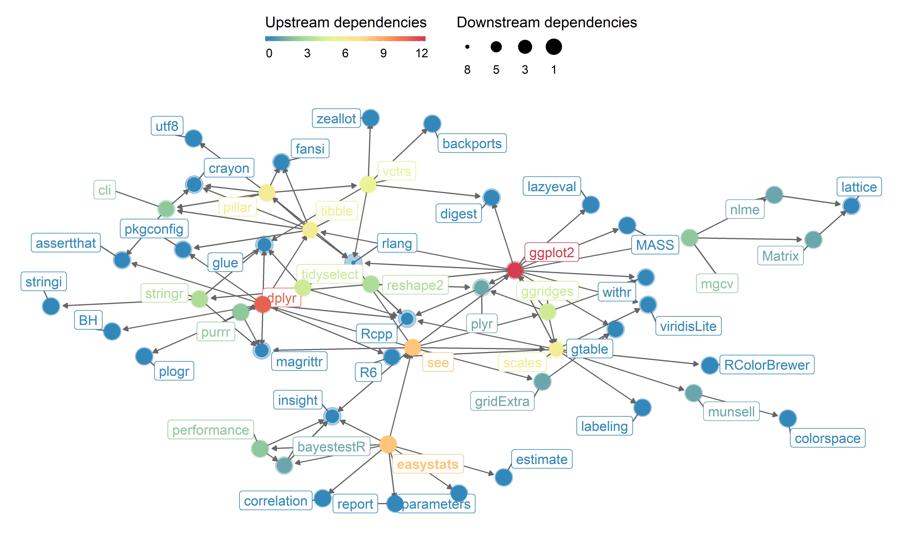

# easystats

<p>


</p>

<p>

<br /><br /><br />

</p>

<p>

<br /><br /><br />

</p>

The aim of **easystats** is to provide a unifying and consistent
framework to tame, discipline and harness the scary R statistics and
their pesky models.

# Installation

The whole `easystats` suite can be installed *at once* with the
following:

``` r
install.packages("devtools")
devtools::install_github("easystats/easystats")
```

``` r
library("easystats")
```

# Features

  - [Compute R2s and other performance indices for all your
    models\!](https://easystats.github.io/blog/posts/performance_presentation/)
  - [How to easily generate a perfectly normal
    distribution](https://easystats.github.io/blog/posts/bayestestr_rnorm_perfect/)
  - [Describe and understand Bayesian models and posteriors using
    bayestestR](https://easystats.github.io/blog/posts/bayestestr_presentation/)
  - [A unified syntax for accessing models’
    information](https://easystats.github.io/blog/posts/insight_presentation/)
  - [The end of errors in ANOVA
    reporting](https://easystats.github.io/blog/posts/report_anova/)
  - [Formatted correlation output with effect
    sizes](https://easystats.github.io/blog/posts/report_correlation/)

# Dependencies

<!-- -->

# Downloads

### Trend


### Cumulative downloads


### By Week Day


# Convention of code-style

Following conventions apply to the easystats-ecosystem, to ensure that
function and argument names as well as element names for return-values
follow a consistent pattern across all packages.

**Importing other packages**

  - No full import, only selective import of functions
  - Use base-R wherever possible (reduce dependencies)
  - Make sure R-version requirements are not too strict

**Helper-functions**

  - Own re-implementation of helper-functions, if it’s not too much
    effort (e.g. I typically use own functions to check if a string
    starts / ends with a pattern, or if an object (list, data frame)
    contains an element with a given name (like `tibble::has_name()`),
    to reduce dependencies.

**Function names**

  - Lower case, underscore separated if more than one verb
  - Common prefix for functions that focus on specific “tasks” or
    workflows (e.g. **insight**, `get_*()` to get data, `find_*()` to
    find information, or **performance**, `performance_*()` to compute
    measures of model quality, `check_*()` to check model assumptions…)
  - Internal functions (that are not exported, like the previously
    mentined helper-functions) should always start with a `.` (e.g.,
    `.do_some_internal_stuff()`).

**Argument names**

  - lower case, underscore separated if more than one verb

**Element / Column names** (for returned data frames)

1)  First letter of the column name is capital, unless (6) applies
    (*example:* `Parameter`)
2)  First letter of nouns is capital, unless (6) applies (*example:*
    `ROPE_Percentage`, `Prior_Scale`)
3)  Using underscore rather than camelCase to separate words (*example:*
    `CI_high`)
4)  Multiple words: common/main part first and
    adjective/specifier/variational part after (*example:*
    `Median_standardized`, `ROPE_percentage`)
5)  Abbreviations: all uppercase (*example:* `ESS`, `MCSE`, `ROPE`)
6)  Keep conventions for reserved words (*example:* `p`, `pd`, `Rhat`)
7)  Adjectives / verbs: all lower case, unless (1) applies (*example:*
    `high` or `low` in `CI_high` or `CI_low`)

# List of functions

  - [**`%>%`**](https://easystats.github.io/report/reference/index.html)
    *(report)*
  - [**`add_plot_attributes`**](https://easystats.github.io/see/reference/index.html)
    *(see)*
  - [**`all_models_equal`**](https://easystats.github.io/insight/reference/index.html)
    *(insight)*
  - [**`area_under_curve`**](https://easystats.github.io/bayestestR/reference/index.html)
    *(bayestestR)*
  - [**`as.numeric_ifnumeric`**](https://easystats.github.io/estimate/reference/index.html)
    *(estimate)*
  - [**`as.report`**](https://easystats.github.io/report/reference/index.html)
    *(report)*
  - [**`auc`**](https://easystats.github.io/bayestestR/reference/index.html)
    *(bayestestR)*
  - [**`bayesfactor_inclusion`**](https://easystats.github.io/bayestestR/reference/index.html)
    *(bayestestR)*
  - [**`bayesfactor_models`**](https://easystats.github.io/bayestestR/reference/index.html)
    *(bayestestR)*
  - [**`bayesfactor_savagedickey`**](https://easystats.github.io/bayestestR/reference/index.html)
    *(bayestestR)*
  - [**`bayesfactor`**](https://easystats.github.io/bayestestR/reference/index.html)
    *(bayestestR)*
  - [**`binned_residuals`**](https://easystats.github.io/performance/reference/index.html)
    *(performance)*
  - [**`check_autocorrelation`**](https://easystats.github.io/performance/reference/index.html)
    *(performance)*
  - [**`check_collinearity`**](https://easystats.github.io/performance/reference/index.html)
    *(performance)*
  - [**`check_convergence`**](https://easystats.github.io/performance/reference/index.html)
    *(performance)*
  - [**`check_distribution`**](https://easystats.github.io/performance/reference/index.html)
    *(performance)*
  - [**`check_heteroscedasticity`**](https://easystats.github.io/performance/reference/index.html)
    *(performance)*
  - [**`check_model`**](https://easystats.github.io/performance/reference/index.html)
    *(performance)*
  - [**`check_normality`**](https://easystats.github.io/performance/reference/index.html)
    *(performance)*
  - [**`check_outliers`**](https://easystats.github.io/performance/reference/index.html)
    *(performance)*
  - [**`check_overdispersion`**](https://easystats.github.io/performance/reference/index.html)
    *(performance)*
  - [**`check_singularity`**](https://easystats.github.io/performance/reference/index.html)
    *(performance)*
  - [**`check_zeroinflation`**](https://easystats.github.io/performance/reference/index.html)
    *(performance)*
  - [**`ci_wald`**](https://easystats.github.io/parameters/reference/index.html)
    *(parameters)*
  - [**`ci`**](https://easystats.github.io/bayestestR/reference/index.html)
    *(bayestestR)*
  - [**`cite_packages`**](https://easystats.github.io/report/reference/index.html)
    *(report)*
  - [**`clean_names`**](https://easystats.github.io/insight/reference/index.html)
    *(insight)*
  - [**`clean_parameters`**](https://easystats.github.io/insight/reference/index.html)
    *(insight)*
  - [**`combine_parameter_objects`**](https://easystats.github.io/insight/reference/index.html)
    *(insight)*
  - [**`compare_performance`**](https://easystats.github.io/performance/reference/index.html)
    *(performance)*
  - [**`convert_d_to_odds`**](https://easystats.github.io/parameters/reference/index.html)
    *(parameters)*
  - [**`convert_d_to_r`**](https://easystats.github.io/parameters/reference/index.html)
    *(parameters)*
  - [**`convert_odds_to_d`**](https://easystats.github.io/parameters/reference/index.html)
    *(parameters)*
  - [**`convert_odds_to_probs`**](https://easystats.github.io/parameters/reference/index.html)
    *(parameters)*
  - [**`convert_p_to_pd`**](https://easystats.github.io/bayestestR/reference/index.html)
    *(bayestestR)*
  - [**`convert_pd_to_p`**](https://easystats.github.io/bayestestR/reference/index.html)
    *(bayestestR)*
  - [**`convert_r_to_d`**](https://easystats.github.io/parameters/reference/index.html)
    *(parameters)*
  - [**`cor_test`**](https://easystats.github.io/correlation/reference/index.html)
    *(correlation)*
  - [**`correlation`**](https://easystats.github.io/correlation/reference/index.html)
    *(correlation)*
  - [**`cronbachs_alpha`**](https://easystats.github.io/performance/reference/index.html)
    *(performance)*
  - [**`d_to_odds`**](https://easystats.github.io/parameters/reference/index.html)
    *(parameters)*
  - [**`d_to_r`**](https://easystats.github.io/parameters/reference/index.html)
    *(parameters)*
  - [**`data_grid`**](https://easystats.github.io/estimate/reference/index.html)
    *(estimate)*
  - [**`data_plot`**](https://easystats.github.io/see/reference/index.html)
    *(see)*
  - [**`density_at`**](https://easystats.github.io/bayestestR/reference/index.html)
    *(bayestestR)*
  - [**`describe_distribution`**](https://easystats.github.io/parameters/reference/index.html)
    *(parameters)*
  - [**`describe_posterior`**](https://easystats.github.io/bayestestR/reference/index.html)
    *(bayestestR)*
  - [**`describe_prior`**](https://easystats.github.io/bayestestR/reference/index.html)
    *(bayestestR)*
  - [**`diagnostic_posterior`**](https://easystats.github.io/bayestestR/reference/index.html)
    *(bayestestR)*
  - [**`distribution_beta`**](https://easystats.github.io/bayestestR/reference/index.html)
    *(bayestestR)*
  - [**`distribution_cauchy`**](https://easystats.github.io/bayestestR/reference/index.html)
    *(bayestestR)*
  - [**`distribution_chisquared`**](https://easystats.github.io/bayestestR/reference/index.html)
    *(bayestestR)*
  - [**`distribution_custom`**](https://easystats.github.io/bayestestR/reference/index.html)
    *(bayestestR)*
  - [**`distribution_mixture_normal`**](https://easystats.github.io/bayestestR/reference/index.html)
    *(bayestestR)*
  - [**`distribution_normal`**](https://easystats.github.io/bayestestR/reference/index.html)
    *(bayestestR)*
  - [**`distribution_poisson`**](https://easystats.github.io/bayestestR/reference/index.html)
    *(bayestestR)*
  - [**`distribution_student`**](https://easystats.github.io/bayestestR/reference/index.html)
    *(bayestestR)*
  - [**`distribution_uniform`**](https://easystats.github.io/bayestestR/reference/index.html)
    *(bayestestR)*
  - [**`distribution`**](https://easystats.github.io/bayestestR/reference/index.html)
    *(bayestestR)*
  - [**`dof_kenward`**](https://easystats.github.io/parameters/reference/index.html)
    *(parameters)*
  - [**`download_model`**](https://easystats.github.io/insight/reference/index.html)
    *(insight)*
  - [**`effective_sample`**](https://easystats.github.io/bayestestR/reference/index.html)
    *(bayestestR)*
  - [**`equivalence_test`**](https://easystats.github.io/bayestestR/reference/index.html)
    *(bayestestR)*
  - [**`estimate_contrasts`**](https://easystats.github.io/estimate/reference/index.html)
    *(estimate)*
  - [**`estimate_density`**](https://easystats.github.io/bayestestR/reference/index.html)
    *(bayestestR)*
  - [**`estimate_fit`**](https://easystats.github.io/estimate/reference/index.html)
    *(estimate)*
  - [**`estimate_means`**](https://easystats.github.io/estimate/reference/index.html)
    *(estimate)*
  - [**`estimate_probability`**](https://easystats.github.io/bayestestR/reference/index.html)
    *(bayestestR)*
  - [**`estimate_response`**](https://easystats.github.io/estimate/reference/index.html)
    *(estimate)*
  - [**`estimate_slopes`**](https://easystats.github.io/estimate/reference/index.html)
    *(estimate)*
  - [**`estimate_smooth`**](https://easystats.github.io/estimate/reference/index.html)
    *(estimate)*
  - [**`find_algorithm`**](https://easystats.github.io/insight/reference/index.html)
    *(insight)*
  - [**`find_formula`**](https://easystats.github.io/insight/reference/index.html)
    *(insight)*
  - [**`find_interactions`**](https://easystats.github.io/insight/reference/index.html)
    *(insight)*
  - [**`find_parameters`**](https://easystats.github.io/insight/reference/index.html)
    *(insight)*
  - [**`find_predictors`**](https://easystats.github.io/insight/reference/index.html)
    *(insight)*
  - [**`find_random_slopes`**](https://easystats.github.io/insight/reference/index.html)
    *(insight)*
  - [**`find_random`**](https://easystats.github.io/insight/reference/index.html)
    *(insight)*
  - [**`find_response`**](https://easystats.github.io/insight/reference/index.html)
    *(insight)*
  - [**`find_terms`**](https://easystats.github.io/insight/reference/index.html)
    *(insight)*
  - [**`find_variables`**](https://easystats.github.io/insight/reference/index.html)
    *(insight)*
  - [**`find_weights`**](https://easystats.github.io/insight/reference/index.html)
    *(insight)*
  - [**`flat_colors`**](https://easystats.github.io/see/reference/index.html)
    *(see)*
  - [**`format_algorithm`**](https://easystats.github.io/report/reference/index.html)
    *(report)*
  - [**`format_bf`**](https://easystats.github.io/report/reference/index.html)
    *(report)*
  - [**`format_ci`**](https://easystats.github.io/report/reference/index.html)
    *(report)*
  - [**`format_model`**](https://easystats.github.io/report/reference/index.html)
    *(report)*
  - [**`format_p`**](https://easystats.github.io/report/reference/index.html)
    *(report)*
  - [**`format_pd`**](https://easystats.github.io/report/reference/index.html)
    *(report)*
  - [**`format_rope`**](https://easystats.github.io/report/reference/index.html)
    *(report)*
  - [**`format_text_collapse`**](https://easystats.github.io/report/reference/index.html)
    *(report)*
  - [**`format_text_wrap`**](https://easystats.github.io/report/reference/index.html)
    *(report)*
  - [**`format_value_unless_integers`**](https://easystats.github.io/report/reference/index.html)
    *(report)*
  - [**`format_value`**](https://easystats.github.io/report/reference/index.html)
    *(report)*
  - [**`generalized_inverse`**](https://easystats.github.io/correlation/reference/index.html)
    *(correlation)*
  - [**`geom_jitter2`**](https://easystats.github.io/see/reference/index.html)
    *(see)*
  - [**`geom_point2`**](https://easystats.github.io/see/reference/index.html)
    *(see)*
  - [**`geom_pooljitter`**](https://easystats.github.io/see/reference/index.html)
    *(see)*
  - [**`geom_poolpoint`**](https://easystats.github.io/see/reference/index.html)
    *(see)*
  - [**`geom_violindot`**](https://easystats.github.io/see/reference/index.html)
    *(see)*
  - [**`geom_violinhalf`**](https://easystats.github.io/see/reference/index.html)
    *(see)*
  - [**`get_correlation_slope_intercept`**](https://easystats.github.io/insight/reference/index.html)
    *(insight)*
  - [**`get_data`**](https://easystats.github.io/insight/reference/index.html)
    *(insight)*
  - [**`get_parameters`**](https://easystats.github.io/insight/reference/index.html)
    *(insight)*
  - [**`get_predictors`**](https://easystats.github.io/insight/reference/index.html)
    *(insight)*
  - [**`get_priors`**](https://easystats.github.io/insight/reference/index.html)
    *(insight)*
  - [**`get_random`**](https://easystats.github.io/insight/reference/index.html)
    *(insight)*
  - [**`get_response`**](https://easystats.github.io/insight/reference/index.html)
    *(insight)*
  - [**`get_variance_dispersion`**](https://easystats.github.io/insight/reference/index.html)
    *(insight)*
  - [**`get_variance_distribution`**](https://easystats.github.io/insight/reference/index.html)
    *(insight)*
  - [**`get_variance_fixed`**](https://easystats.github.io/insight/reference/index.html)
    *(insight)*
  - [**`get_variance_intercept`**](https://easystats.github.io/insight/reference/index.html)
    *(insight)*
  - [**`get_variance_random`**](https://easystats.github.io/insight/reference/index.html)
    *(insight)*
  - [**`get_variance_residual`**](https://easystats.github.io/insight/reference/index.html)
    *(insight)*
  - [**`get_variance_slope`**](https://easystats.github.io/insight/reference/index.html)
    *(insight)*
  - [**`get_variance`**](https://easystats.github.io/insight/reference/index.html)
    *(insight)*
  - [**`get_weights`**](https://easystats.github.io/insight/reference/index.html)
    *(insight)*
  - [**`has_intercept`**](https://easystats.github.io/insight/reference/index.html)
    *(insight)*
  - [**`hdi`**](https://easystats.github.io/bayestestR/reference/index.html)
    *(bayestestR)*
  - [**`how_to_plot`**](https://easystats.github.io/see/reference/index.html)
    *(see)*
  - [**`icc`**](https://easystats.github.io/performance/reference/index.html)
    *(performance)*
  - [**`interpret_bf`**](https://easystats.github.io/report/reference/index.html)
    *(report)*
  - [**`interpret_d`**](https://easystats.github.io/report/reference/index.html)
    *(report)*
  - [**`interpret_direction`**](https://easystats.github.io/report/reference/index.html)
    *(report)*
  - [**`interpret_effective_sample`**](https://easystats.github.io/report/reference/index.html)
    *(report)*
  - [**`interpret_odds`**](https://easystats.github.io/report/reference/index.html)
    *(report)*
  - [**`interpret_omega_squared`**](https://easystats.github.io/report/reference/index.html)
    *(report)*
  - [**`interpret_p`**](https://easystats.github.io/report/reference/index.html)
    *(report)*
  - [**`interpret_r`**](https://easystats.github.io/report/reference/index.html)
    *(report)*
  - [**`interpret_r2`**](https://easystats.github.io/report/reference/index.html)
    *(report)*
  - [**`interpret_rhat`**](https://easystats.github.io/report/reference/index.html)
    *(report)*
  - [**`interpret_rope`**](https://easystats.github.io/report/reference/index.html)
    *(report)*
  - [**`interpret`**](https://easystats.github.io/report/reference/index.html)
    *(report)*
  - [**`is.int`**](https://easystats.github.io/report/reference/index.html)
    *(report)*
  - [**`is.report`**](https://easystats.github.io/report/reference/index.html)
    *(report)*
  - [**`is.rules`**](https://easystats.github.io/report/reference/index.html)
    *(report)*
  - [**`is_model`**](https://easystats.github.io/insight/reference/index.html)
    *(insight)*
  - [**`is_multivariate`**](https://easystats.github.io/insight/reference/index.html)
    *(insight)*
  - [**`is_nullmodel`**](https://easystats.github.io/insight/reference/index.html)
    *(insight)*
  - [**`item_difficulty`**](https://easystats.github.io/performance/reference/index.html)
    *(performance)*
  - [**`item_intercor`**](https://easystats.github.io/performance/reference/index.html)
    *(performance)*
  - [**`item_reliability`**](https://easystats.github.io/performance/reference/index.html)
    *(performance)*
  - [**`item_split_half`**](https://easystats.github.io/performance/reference/index.html)
    *(performance)*
  - [**`kurtosis`**](https://easystats.github.io/parameters/reference/index.html)
    *(parameters)*
  - [**`link_function`**](https://easystats.github.io/insight/reference/index.html)
    *(insight)*
  - [**`link_inverse`**](https://easystats.github.io/insight/reference/index.html)
    *(insight)*
  - [**`looic`**](https://easystats.github.io/performance/reference/index.html)
    *(performance)*
  - [**`map_estimate`**](https://easystats.github.io/bayestestR/reference/index.html)
    *(bayestestR)*
  - [**`marginal_parameters`**](https://easystats.github.io/parameters/reference/index.html)
    *(parameters)*
  - [**`material_colors`**](https://easystats.github.io/see/reference/index.html)
    *(see)*
  - [**`mcse`**](https://easystats.github.io/bayestestR/reference/index.html)
    *(bayestestR)*
  - [**`model_bootstrap`**](https://easystats.github.io/parameters/reference/index.html)
    *(parameters)*
  - [**`model_info`**](https://easystats.github.io/insight/reference/index.html)
    *(insight)*
  - [**`model_parameters`**](https://easystats.github.io/parameters/reference/index.html)
    *(parameters)*
  - [**`model_performance`**](https://easystats.github.io/performance/reference/index.html)
    *(performance)*
  - [**`model_values`**](https://easystats.github.io/report/reference/index.html)
    *(report)*
  - [**`mse`**](https://easystats.github.io/performance/reference/index.html)
    *(performance)*
  - [**`n_obs`**](https://easystats.github.io/insight/reference/index.html)
    *(insight)*
  - [**`normalize`**](https://easystats.github.io/parameters/reference/index.html)
    *(parameters)*
  - [**`odds_to_d`**](https://easystats.github.io/parameters/reference/index.html)
    *(parameters)*
  - [**`odds_to_probs`**](https://easystats.github.io/parameters/reference/index.html)
    *(parameters)*
  - [**`omega_squared`**](https://easystats.github.io/parameters/reference/index.html)
    *(parameters)*
  - [**`p_direction`**](https://easystats.github.io/bayestestR/reference/index.html)
    *(bayestestR)*
  - [**`p_map`**](https://easystats.github.io/bayestestR/reference/index.html)
    *(bayestestR)*
  - [**`p_rope`**](https://easystats.github.io/bayestestR/reference/index.html)
    *(bayestestR)*
  - [**`p_to_pd`**](https://easystats.github.io/bayestestR/reference/index.html)
    *(bayestestR)*
  - [**`p_value_kenward`**](https://easystats.github.io/parameters/reference/index.html)
    *(parameters)*
  - [**`p_value_wald`**](https://easystats.github.io/parameters/reference/index.html)
    *(parameters)*
  - [**`p_value`**](https://easystats.github.io/parameters/reference/index.html)
    *(parameters)*
  - [**`palette_flat`**](https://easystats.github.io/see/reference/index.html)
    *(see)*
  - [**`palette_material`**](https://easystats.github.io/see/reference/index.html)
    *(see)*
  - [**`palette_pizza`**](https://easystats.github.io/see/reference/index.html)
    *(see)*
  - [**`parameters_bootstrap`**](https://easystats.github.io/parameters/reference/index.html)
    *(parameters)*
  - [**`parameters_selection`**](https://easystats.github.io/parameters/reference/index.html)
    *(parameters)*
  - [**`parameters_standardize`**](https://easystats.github.io/parameters/reference/index.html)
    *(parameters)*
  - [**`pd_to_p`**](https://easystats.github.io/bayestestR/reference/index.html)
    *(bayestestR)*
  - [**`pd`**](https://easystats.github.io/bayestestR/reference/index.html)
    *(bayestestR)*
  - [**`performance_accuracy`**](https://easystats.github.io/performance/reference/index.html)
    *(performance)*
  - [**`performance_aicc`**](https://easystats.github.io/performance/reference/index.html)
    *(performance)*
  - [**`performance_hosmer`**](https://easystats.github.io/performance/reference/index.html)
    *(performance)*
  - [**`performance_logloss`**](https://easystats.github.io/performance/reference/index.html)
    *(performance)*
  - [**`performance_mse`**](https://easystats.github.io/performance/reference/index.html)
    *(performance)*
  - [**`performance_pcp`**](https://easystats.github.io/performance/reference/index.html)
    *(performance)*
  - [**`performance_rmse`**](https://easystats.github.io/performance/reference/index.html)
    *(performance)*
  - [**`performance_roc`**](https://easystats.github.io/performance/reference/index.html)
    *(performance)*
  - [**`performance_rse`**](https://easystats.github.io/performance/reference/index.html)
    *(performance)*
  - [**`performance_score`**](https://easystats.github.io/performance/reference/index.html)
    *(performance)*
  - [**`pizza_colors`**](https://easystats.github.io/see/reference/index.html)
    *(see)*
  - [**`plots`**](https://easystats.github.io/see/reference/index.html)
    *(see)*
  - [**`point_estimate`**](https://easystats.github.io/bayestestR/reference/index.html)
    *(bayestestR)*
  - [**`principal_components`**](https://easystats.github.io/parameters/reference/index.html)
    *(parameters)*
  - [**`print_color`**](https://easystats.github.io/insight/reference/index.html)
    *(insight)*
  - [**`print_colour`**](https://easystats.github.io/insight/reference/index.html)
    *(insight)*
  - [**`probability_at`**](https://easystats.github.io/bayestestR/reference/index.html)
    *(bayestestR)*
  - [**`r_to_d`**](https://easystats.github.io/parameters/reference/index.html)
    *(parameters)*
  - [**`r2_bayes`**](https://easystats.github.io/performance/reference/index.html)
    *(performance)*
  - [**`r2_coxsnell`**](https://easystats.github.io/performance/reference/index.html)
    *(performance)*
  - [**`r2_kl`**](https://easystats.github.io/performance/reference/index.html)
    *(performance)*
  - [**`r2_loo`**](https://easystats.github.io/performance/reference/index.html)
    *(performance)*
  - [**`r2_mcfadden`**](https://easystats.github.io/performance/reference/index.html)
    *(performance)*
  - [**`r2_mckelvey`**](https://easystats.github.io/performance/reference/index.html)
    *(performance)*
  - [**`r2_nagelkerke`**](https://easystats.github.io/performance/reference/index.html)
    *(performance)*
  - [**`r2_nakagawa`**](https://easystats.github.io/performance/reference/index.html)
    *(performance)*
  - [**`r2_tjur`**](https://easystats.github.io/performance/reference/index.html)
    *(performance)*
  - [**`r2_xu`**](https://easystats.github.io/performance/reference/index.html)
    *(performance)*
  - [**`r2_zeroinflated`**](https://easystats.github.io/performance/reference/index.html)
    *(performance)*
  - [**`r2`**](https://easystats.github.io/performance/reference/index.html)
    *(performance)*
  - [**`remove_triangular`**](https://easystats.github.io/correlation/reference/index.html)
    *(correlation)*
  - [**`rename_if_possible`**](https://easystats.github.io/report/reference/index.html)
    *(report)*
  - [**`report`**](https://easystats.github.io/report/reference/index.html)
    *(report)*
  - [**`reshape_draws`**](https://easystats.github.io/estimate/reference/index.html)
    *(estimate)*
  - [**`rmse`**](https://easystats.github.io/performance/reference/index.html)
    *(performance)*
  - [**`rnorm_perfect`**](https://easystats.github.io/bayestestR/reference/index.html)
    *(bayestestR)*
  - [**`rope_range`**](https://easystats.github.io/bayestestR/reference/index.html)
    *(bayestestR)*
  - [**`rope`**](https://easystats.github.io/bayestestR/reference/index.html)
    *(bayestestR)*
  - [**`rules`**](https://easystats.github.io/report/reference/index.html)
    *(report)*
  - [**`scale_color_flat_c`**](https://easystats.github.io/see/reference/index.html)
    *(see)*
  - [**`scale_color_flat_d`**](https://easystats.github.io/see/reference/index.html)
    *(see)*
  - [**`scale_color_flat`**](https://easystats.github.io/see/reference/index.html)
    *(see)*
  - [**`scale_color_material_c`**](https://easystats.github.io/see/reference/index.html)
    *(see)*
  - [**`scale_color_material_d`**](https://easystats.github.io/see/reference/index.html)
    *(see)*
  - [**`scale_color_material`**](https://easystats.github.io/see/reference/index.html)
    *(see)*
  - [**`scale_color_pizza_c`**](https://easystats.github.io/see/reference/index.html)
    *(see)*
  - [**`scale_color_pizza_d`**](https://easystats.github.io/see/reference/index.html)
    *(see)*
  - [**`scale_color_pizza`**](https://easystats.github.io/see/reference/index.html)
    *(see)*
  - [**`scale_colour_flat_c`**](https://easystats.github.io/see/reference/index.html)
    *(see)*
  - [**`scale_colour_flat_d`**](https://easystats.github.io/see/reference/index.html)
    *(see)*
  - [**`scale_colour_flat`**](https://easystats.github.io/see/reference/index.html)
    *(see)*
  - [**`scale_colour_material_c`**](https://easystats.github.io/see/reference/index.html)
    *(see)*
  - [**`scale_colour_material_d`**](https://easystats.github.io/see/reference/index.html)
    *(see)*
  - [**`scale_colour_material`**](https://easystats.github.io/see/reference/index.html)
    *(see)*
  - [**`scale_colour_pizza_c`**](https://easystats.github.io/see/reference/index.html)
    *(see)*
  - [**`scale_colour_pizza_d`**](https://easystats.github.io/see/reference/index.html)
    *(see)*
  - [**`scale_colour_pizza`**](https://easystats.github.io/see/reference/index.html)
    *(see)*
  - [**`scale_fill_flat_c`**](https://easystats.github.io/see/reference/index.html)
    *(see)*
  - [**`scale_fill_flat_d`**](https://easystats.github.io/see/reference/index.html)
    *(see)*
  - [**`scale_fill_flat`**](https://easystats.github.io/see/reference/index.html)
    *(see)*
  - [**`scale_fill_material_c`**](https://easystats.github.io/see/reference/index.html)
    *(see)*
  - [**`scale_fill_material_d`**](https://easystats.github.io/see/reference/index.html)
    *(see)*
  - [**`scale_fill_material`**](https://easystats.github.io/see/reference/index.html)
    *(see)*
  - [**`scale_fill_pizza_c`**](https://easystats.github.io/see/reference/index.html)
    *(see)*
  - [**`scale_fill_pizza_d`**](https://easystats.github.io/see/reference/index.html)
    *(see)*
  - [**`scale_fill_pizza`**](https://easystats.github.io/see/reference/index.html)
    *(see)*
  - [**`show_packages`**](https://easystats.github.io/report/reference/index.html)
    *(report)*
  - [**`skewness`**](https://easystats.github.io/parameters/reference/index.html)
    *(parameters)*
  - [**`smoothness`**](https://easystats.github.io/parameters/reference/index.html)
    *(parameters)*
  - [**`standard_error`**](https://easystats.github.io/parameters/reference/index.html)
    *(parameters)*
  - [**`standardize`**](https://easystats.github.io/parameters/reference/index.html)
    *(parameters)*
  - [**`theme_abyss`**](https://easystats.github.io/see/reference/index.html)
    *(see)*
  - [**`theme_blackboard`**](https://easystats.github.io/see/reference/index.html)
    *(see)*
  - [**`theme_lucid`**](https://easystats.github.io/see/reference/index.html)
    *(see)*
  - [**`theme_modern`**](https://easystats.github.io/see/reference/index.html)
    *(see)*
  - [**`to_fulltable`**](https://easystats.github.io/report/reference/index.html)
    *(report)*
  - [**`to_fulltext`**](https://easystats.github.io/report/reference/index.html)
    *(report)*
  - [**`to_table`**](https://easystats.github.io/report/reference/index.html)
    *(report)*
  - [**`to_text`**](https://easystats.github.io/report/reference/index.html)
    *(report)*
  - [**`to_values`**](https://easystats.github.io/report/reference/index.html)
    *(report)*
  - [**`zero_crossings`**](https://easystats.github.io/estimate/reference/index.html)
    *(estimate)*
