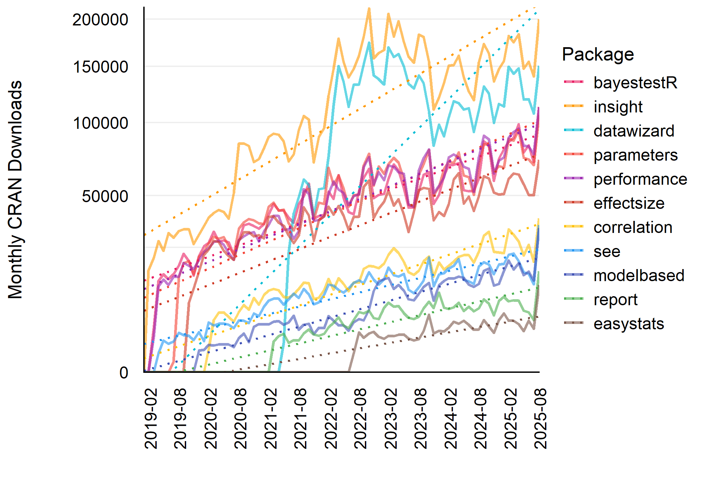

# *easystats*: An R Framework for Easy Statistical Modeling, Visualization, and Reporting

<!-- [](https://github.com/easystats/easystats/blob/master/inst/CITATION) -->

[](https://cran.r-project.org/package=easystats)
[](https://cranlogs.r-pkg.org/)

## What is *easystats*?

*easystats* is a collection of R packages, which aims to provide a
unifying and consistent framework to tame, discipline, and harness the
scary R statistics and their pesky models.

However, there is not (yet) an *unique* “easystats” way of doing data
analysis. Instead, start with one package and, when you’ll face a new
challenge, do check if there is an *easystats* answer for it in other
packages. You will slowly uncover how using them together facilitates
your life. And, who knows, you might even end up using them all.


## Installation

[](https://cran.r-project.org/package=easystats)
[](https://easystats.r-universe.dev)
[](https://github.com/easystats/easystats/actions)

| Type | Source | Command |
|:---|:---|:---|
| Release | CRAN | `install.packages("easystats")` |
| Development | r-universe | `install.packages("easystats", repos = "https://easystats.r-universe.dev")` |
| Development | GitHub | `remotes::install_github("easystats/easystats")` |

Finally, as *easystats* sometimes depends on some additional packages
for specific functions that are not downloaded by default. If you want
to benefit from the **full *easystats* experience** without any hiccups,
simply run the following:

``` r
easystats::install_suggested()
```

## Citation

To cite the package, run the following command:

``` r
citation("easystats")
To cite easystats in publications use:

  Lüdecke, Patil, Ben-Shachar, Wiernik, Bacher, Thériault, & Makowski
  (2022). easystats: Framework for Easy Statistical Modeling,
  Visualization, and Reporting. CRAN.
  doi:10.32614/CRAN.package.easystats
  <https://doi.org/10.32614/CRAN.package.easystats>

A BibTeX entry for LaTeX users is

  @Article{,
    title = {easystats: Framework for Easy Statistical Modeling, Visualization, and Reporting},
    author = {Daniel Lüdecke and Mattan S. Ben-Shachar and Indrajeet Patil and Brenton M. Wiernik and Etienne Bacher and Rémi Thériault and Dominique Makowski},
    journal = {CRAN},
    doi = {10.32614/CRAN.package.easystats},
    year = {2022},
    note = {R package},
    url = {https://easystats.github.io/easystats/},
  }
```

If you want to do this only for certain packages in the ecosystem, have
a look at this article on how you can do so!
<https://easystats.github.io/easystats/articles/citation.html>

## Getting started

Each *easystats* package has a different scope and purpose. This means
your **best way to start** is to explore and pick the one(s) that you
feel might be useful to you. However, as they are built with a “bigger
picture” in mind, you will realize that using more of them creates a
smooth workflow, as these packages are meant to work together. Ideally,
these packages work in unison to cover all aspects of statistical
analysis and data visualization.

- [**report**](https://easystats.github.io/report/): 📜 🎉 Automated
  statistical reporting of objects in R
- [**correlation**](https://easystats.github.io/correlation/): 🔗 Your
  all-in-one package to run correlations
- [**modelbased**](https://easystats.github.io/modelbased/): 📈 Estimate
  effects, group averages and contrasts between groups based on
  statistical models
- [**bayestestR**](https://easystats.github.io/bayestestR/): 👻 Great
  for beginners or experts of Bayesian statistics
- [**effectsize**](https://easystats.github.io/effectsize/): 🐉 Compute,
  convert, interpret and work with indices of effect size and
  standardized parameters
- [**see**](https://easystats.github.io/see/): 🎨 The plotting companion
  to create beautiful results visualizations
- [**parameters**](https://easystats.github.io/parameters/): 📊 Obtain a
  table containing all information about the parameters of your models
- [**performance**](https://easystats.github.io/performance/): 💪
  Models’ quality and performance metrics (R2, ICC, LOO, AIC, BF, …)
- [**insight**](https://easystats.github.io/insight/): 🔮 For
  developers, a package to help you work with different models and
  packages
- [**datawizard**](https://easystats.github.io/datawizard/): 🧙 Magic
  potions to clean and transform your data

## Frequently Asked Questions

**How is *easystats* different from the *tidyverse*?**

You’ve probably already heard about the
[**tidyverse**](https://www.tidyverse.org/), another very popular
collection of packages (*ggplot*, *dplyr*, *tidyr*, …) that also makes
using R easier. So, should you pick the *tidyverse* or *easystats*?
**Pick both!**

Indeed, these two ecosystems have been designed with very different
goals in mind. The *tidyverse* packages are primarily made to create a
new R experience, where data manipulation and exploration is intuitive
and consistent. On the other hand, **easystats** focuses more on the
final stretch of the analysis: understanding and interpreting your
results and reporting them in a manuscript or a report, while following
best practices. You can definitely use the *easystats* functions in a
*tidyverse* workflow!

> **easystats + tidyverse =** ❤️

**Can *easystats* be useful to advanced users and/or developers?**

Yes, definitely! **easystats** is built in terms of modules that are
general enough to be used inside other packages. For instance, the
*insight* package is made to easily implement support for
post-processing of pretty much all regression model packages under the
sun. We use it in all the *easystats* packages, but it is also used in
other non-easystats packages, such as
[**ggstatsplot**](https://github.com/IndrajeetPatil/ggstatsplot),
[**modelsummary**](https://github.com/vincentarelbundock/modelsummary/),
[**ggeffects**](https://github.com/strengejacke/ggeffects), and more.

**So why not in yours**?

Moreover, the *easystats* packages are very lightweight, with a minimal
set of dependencies, which again makes it great if you want to rely on
them.

## Documentation

### Websites

Each `easystats` package has a dedicated website.

For example, website for `parameters` is
<https://easystats.github.io/parameters/>.

### Blog

In addition to the websites containing documentation for these packages,
you can also read posts from `easystats` blog:
<https://easystats.github.io/blog/posts/>.

### Other learning resources

In addition to these websites and blog posts, you can also check out the
following presentations and talks to learn more about this ecosystem:

<https://easystats.github.io/easystats/articles/resources.html>

## Dependencies

*easystats* packages are designed to be lightweight, *i.e.*, they don’t
have any third-party hard dependencies, other than base-R packages or
other *easystats* packages! If you develop R packages, this means that
you can safely use *easystats* packages as dependencies in your own
packages, without the risk of entering the [dependency
hell](https://en.wikipedia.org/wiki/Dependency_hell).

``` r
library(deepdep)

plot_dependencies("easystats", depth = 2, show_stamp = FALSE)
```


As we can see, the only exception is the
[`{see}`](https://easystats.github.io/see/) package, which is
responsible for plotting and creating figures and relies on `{ggplot2}`,
which does have a substantial number of dependencies.

## Usage

### Total downloads

| Total | insight | datawizard | parameters | performance | bayestestR | effectsize | correlation | see | modelbased | report | easystats |
|:---|:---|:---|:---|:---|:---|:---|:---|:---|:---|:---|:---|
| 25,121,513 | 7,260,544 | 4,481,391 | 3,052,090 | 2,989,395 | 2,907,643 | 2,304,575 | 794,680 | 642,074 | 397,164 | 217,376 | 74,581 |

### Trend



<!-- ### Average monthly downloads -->

## Contributing

We are happy to receive bug reports, suggestions, questions, and (most
of all) contributions to fix problems and add features. Pull Requests
for contributions are encouraged.

Here are some simple ways in which you can contribute (in the increasing
order of commitment):

- Read and correct any inconsistencies in the documentation
- Raise issues about bugs or wanted features
- Review code
- Add new functionality

## Code of Conduct

Please note that the ‘easystats’ project is released with a [Contributor
Code of
Conduct](https://easystats.github.io/easystats/CODE_OF_CONDUCT.html). By
contributing to this project, you agree to abide by its terms.
