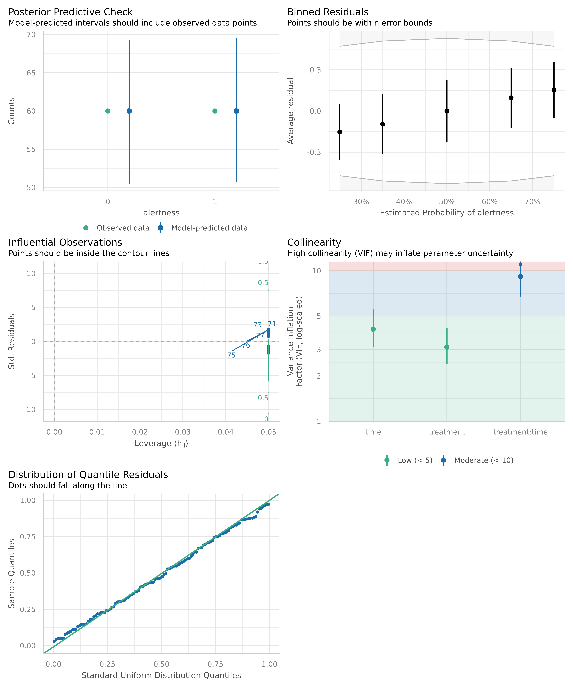

# Analytic workflow: A complete workflow using easystats

This vignette demonstrates a typical workflow using *easystats*
packages, with a logistic regression model as an example. We will
explore various aspects of the model, such as model coefficients, model
fit, predictions, and pairwise comparisons. Let’s get started!

## Preparing the data

The very first step is usually importing and preparing some data
(recoding, re-shaping data and so on - the usual data wrangling tasks),
which is easily done using the **datawizard** package. In this example,
we use *datawizard* only for some minor recodings. The `coffee_data`
data set is included in the *modelbased* package. The data set contains
information on the effect of coffee consumption on alertness over time.
The outcome variable is binary (alertness), and the predictor variables
are coffee consumption (treatment) and time.

``` r

library(datawizard) # for data management, e.g. recodings

data(coffee_data, package = "modelbased")

# dichotomize outcome variable
coffee_data$alertness <- categorize(coffee_data$alertness, lowest = 0)
# rename variable
coffee_data <- data_rename(coffee_data, select = c(treatment = "coffee"))
```

## Sample description

In a next step, it might make sense to look at the data. E.g., a
frequency table using
[`data_tabulate()`](https://easystats.github.io/datawizard/reference/data_tabulate.html),
or a description of the most important sample characteristics using
[`report_sample()`](https://easystats.github.io/report/reference/report_sample.html).
The latter is usually already a table shown in publications.

Functions to create descriptive tables or text reports are located in
the **datawizard** and **report** packages.

``` r

library(report)

# Frequency table
data_tabulate(coffee_data, c("treatment", "time"))
#> treatment (treatment) <categorical>
#> # total N=120 valid N=120
#> 
#> Value   |  N | Raw % | Valid % | Cumulative %
#> --------+----+-------+---------+-------------
#> coffee  | 60 |    50 |      50 |           50
#> control | 60 |    50 |      50 |          100
#> <NA>    |  0 |     0 |    <NA> |         <NA>
#> 
#> time (time) <categorical>
#> # total N=120 valid N=120
#> 
#> Value     |  N | Raw % | Valid % | Cumulative %
#> ----------+----+-------+---------+-------------
#> morning   | 40 | 33.33 |   33.33 |        33.33
#> noon      | 40 | 33.33 |   33.33 |        66.67
#> afternoon | 40 | 33.33 |   33.33 |       100.00
#> <NA>      |  0 |  0.00 |    <NA> |         <NA>

# Cross table
data_tabulate(coffee_data, "treatment", by = "time")
#> treatment | morning | noon | afternoon | <NA> | Total
#> ----------+---------+------+-----------+------+------
#> coffee    |      20 |   20 |        20 |    0 |    60
#> control   |      20 |   20 |        20 |    0 |    60
#> <NA>      |       0 |    0 |         0 |    0 |     0
#> ----------+---------+------+-----------+------+------
#> Total     |      40 |   40 |        40 |    0 |   120

# Sample description
report_sample(
  coffee_data,
  by = "treatment",
  select = c("alertness", "time"),
  ci = 0.95
)
#> # Descriptive Statistics
#> 
#> Variable            |     coffee (n=60) |    control (n=60) |     Total (n=120)
#> -------------------------------------------------------------------------------
#> Mean alertness (SD) |       0.53 (0.50) |       0.47 (0.50) |       0.50 (0.50)
#> time [morning], %   | 33.3 [22.7, 45.9] | 33.3 [22.7, 45.9] | 33.3 [25.5, 42.2]
#> time [noon], %      | 33.3 [22.7, 45.9] | 33.3 [22.7, 45.9] | 33.3 [25.5, 42.2]
#> time [afternoon], % | 33.3 [22.7, 45.9] | 33.3 [22.7, 45.9] | 33.3 [25.5, 42.2]
```

## Fitting and exploring the model - model coefficients

Let’s start by fitting an example model and examining the model
coefficients. The package that manages everything related to model
coefficients is the **parameters** package. We can use the
[`model_parameters()`](https://easystats.github.io/parameters/reference/model_parameters.html)
function to extract the coefficients from the model. By setting
`exponentiate = TRUE`, we can obtain the odds ratios for the
coefficients.

``` r

library(parameters)

# model
model <- glm(alertness ~ treatment * time, data = coffee_data, family = binomial())

# coefficients
model_parameters(model, exponentiate = TRUE)
#> Parameter                              | Odds Ratio |   SE |        95% CI |         z |      p
#> -----------------------------------------------------------------------------------------------
#> (Intercept)                            |       1.00 | 0.45 | [0.41,  2.44] | -1.42e-15 | > .999
#> treatment [control]                    |       0.33 | 0.23 | [0.08,  1.23] |     -1.61 | 0.108 
#> time [noon]                            |       0.54 | 0.35 | [0.15,  1.90] |     -0.96 | 0.339 
#> time [afternoon]                       |       3.00 | 2.05 | [0.81, 12.24] |      1.61 | 0.108 
#> treatment [control] × time [noon]      |      10.35 | 9.85 | [1.66, 70.73] |      2.45 | 0.014 
#> treatment [control] × time [afternoon] |       1.00 | 0.97 | [0.15,  6.74] | -6.10e-16 | > .999
#> 
#> Uncertainty intervals (profile-likelihood) and p-values (two-tailed) computed using a Wald z-distribution approximation.
```

The model coefficients are difficult to interpret directly, in
particular since we have an interaction effect. Instead, we should use
the *modelbased* package to calculate adjusted predictions for the
model. But before we do that, we want to know more about the model
quality.

## Assessing model fit

Now that we have a first impression our model, it is time to ask whether
we have a good or bad model fit and check our model assumptions.
Inspecting model quality and fit indices is supported by the
**performance** package. A useful function to do so is
[`check_model()`](https://easystats.github.io/performance/reference/check_model.html),
which gives a graphical summary of several important model checks.

``` r

library(performance)

# checking model assunptions
check_model(model)
```



The plot looks good - we don’t seem to have concerning issues. If you
want to learn more about interpreting these plots, [check out this
vignette](https://easystats.github.io/performance/articles/check_model.html).
Read [this
vignette](https://easystats.github.io/easystats/articles/workflow_performance.html)
if you want to learn more about how to *improve* your models.

## Predicted probabilities - understanding the model

As we mentioned above, interpreting model results can be hard, and
sometimes even misleading, if you only look at the regression
coefficients. Instead, it is useful to estimate model-based means or
probabilities for the outcome. Ab absolutely easy way to make
interpretation easier is to use the **modelbased** package. You just
need to provide your predictors of interest, so called *focal terms*.

Since we are interested in the interaction effect of coffee consumption
(treatment) on alertness depending on different times of the day, we
simply specify these two variables as *focal terms* in the
[`estimate_means()`](https://easystats.github.io/modelbased/reference/estimate_means.html)
function. This function calculates predictions on the response scale of
the regression model. For logistic regression models, *predicted
probabilities* are calculated. These refer to the adjusted probabilities
of the outcome (higher alertness) depending on the predictor variables
(treatment and time).

``` r

library(modelbased)

# predicted probabilities
predictions <- estimate_means(model, c("time", "treatment"))
predictions
#> Estimated Marginal Means
#> 
#> time      | treatment | Probability |       95% CI
#> --------------------------------------------------
#> morning   | coffee    |        0.50 | [0.29, 0.71]
#> noon      | coffee    |        0.35 | [0.18, 0.57]
#> afternoon | coffee    |        0.75 | [0.52, 0.89]
#> morning   | control   |        0.25 | [0.11, 0.48]
#> noon      | control   |        0.65 | [0.43, 0.82]
#> afternoon | control   |        0.50 | [0.29, 0.71]
#> 
#> Variable predicted: alertness
#> Predictors modulated: time, treatment
#> Predictions are on the response-scale.
```

We now see that high `alertness` was most likely for the `coffee` group
in the `afternoon` time (about 75% probability of high alertness for the
afternoon-coffee group).

We can also visualize these results, using the
[`plot()`](https://rdrr.io/r/graphics/plot.default.html) method. In
short, this will give us a visual interpretation of the model.

``` r

# plot predicted probabilities
plot(predictions)
```


We can also see that the predicted probabilities of alertness are higher
for participants who consumed coffee compared to those who did not, but
only in the morning and in the afternoon. Furthermore, we see
differences between the *coffee* and the *control* group at each time
point - but are these differences statistically significant?

## Pairwise comparisons - testing the differences

To check this, we finally use the
[`estimate_contrasts()`](https://easystats.github.io/modelbased/reference/estimate_contrasts.html)
function to perform pairwise comparisons of the predicted probabilities.
This function needs to know the variables that should be compared, or
*contrasted*. In a first step, we want to compare all levels of the
variables involved in our interaction term (our *focal terms* from
above).

``` r

# pairwise comparisons - quite long table
estimate_contrasts(model, c("time", "treatment"))
#> Marginal Contrasts Analysis
#> 
#> Level1             | Level2            | Difference |   SE |        95% CI |     z |      p
#> -------------------------------------------------------------------------------------------
#> morning, control   | morning, coffee   |      -0.25 | 0.15 | [-0.54, 0.04] | -1.69 |  0.091
#> noon, coffee       | morning, coffee   |      -0.15 | 0.15 | [-0.45, 0.15] | -0.97 |  0.332
#> noon, control      | morning, coffee   |       0.15 | 0.15 | [-0.15, 0.45] |  0.97 |  0.332
#> afternoon, coffee  | morning, coffee   |       0.25 | 0.15 | [-0.04, 0.54] |  1.69 |  0.091
#> afternoon, control | morning, coffee   |       0.00 | 0.16 | [-0.31, 0.31] |  0.00 | > .999
#> noon, coffee       | morning, control  |       0.10 | 0.14 | [-0.18, 0.38] |  0.69 |  0.488
#> noon, control      | morning, control  |       0.40 | 0.14 | [ 0.12, 0.68] |  2.78 |  0.005
#> afternoon, coffee  | morning, control  |       0.50 | 0.14 | [ 0.23, 0.77] |  3.65 | < .001
#> afternoon, control | morning, control  |       0.25 | 0.15 | [-0.04, 0.54] |  1.69 |  0.091
#> noon, control      | noon, coffee      |       0.30 | 0.15 | [ 0.00, 0.60] |  1.99 |  0.047
#> afternoon, coffee  | noon, coffee      |       0.40 | 0.14 | [ 0.12, 0.68] |  2.78 |  0.005
#> afternoon, control | noon, coffee      |       0.15 | 0.15 | [-0.15, 0.45] |  0.97 |  0.332
#> afternoon, coffee  | noon, control     |       0.10 | 0.14 | [-0.18, 0.38] |  0.69 |  0.488
#> afternoon, control | noon, control     |      -0.15 | 0.15 | [-0.45, 0.15] | -0.97 |  0.332
#> afternoon, control | afternoon, coffee |      -0.25 | 0.15 | [-0.54, 0.04] | -1.69 |  0.091
#> 
#> Variable predicted: alertness
#> Predictors contrasted: time, treatment
#> p-values are uncorrected.
#> Contrasts are on the response-scale.
```

In the above output, we see all possible pairwise comparisons of the
predicted probabilities. The table is quite long, but we can also group
the comparisons, e.g. by the variable *time*.

``` r

# group comparisons by "time"
estimate_contrasts(model, "treatment", by = "time")
#> Marginal Contrasts Analysis
#> 
#> Level1  | Level2 | time      | Difference |   SE |        95% CI |     z |     p
#> --------------------------------------------------------------------------------
#> control | coffee | morning   |      -0.25 | 0.15 | [-0.54, 0.04] | -1.69 | 0.091
#> control | coffee | noon      |       0.30 | 0.15 | [ 0.00, 0.60] |  1.99 | 0.047
#> control | coffee | afternoon |      -0.25 | 0.15 | [-0.54, 0.04] | -1.69 | 0.091
#> 
#> Variable predicted: alertness
#> Predictors contrasted: treatment
#> p-values are uncorrected.
#> Contrasts are on the response-scale.
```

The output shows that the differences between the *coffee* and the
*control* group are statistically significant only in the noon time.
