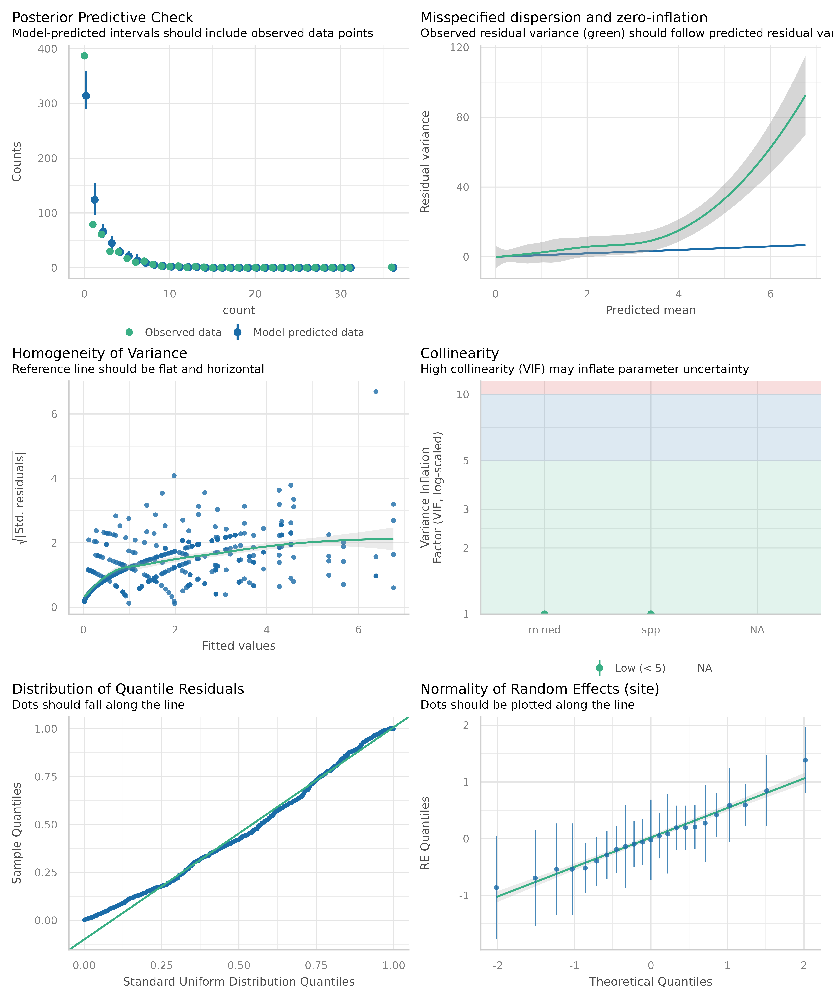
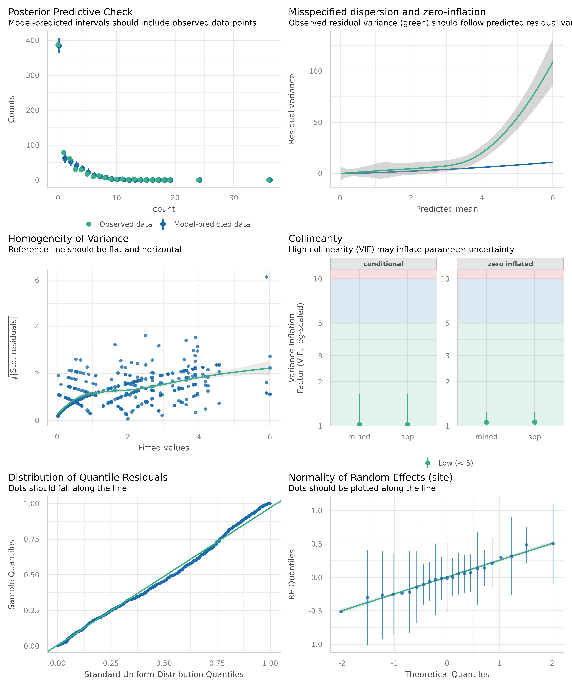
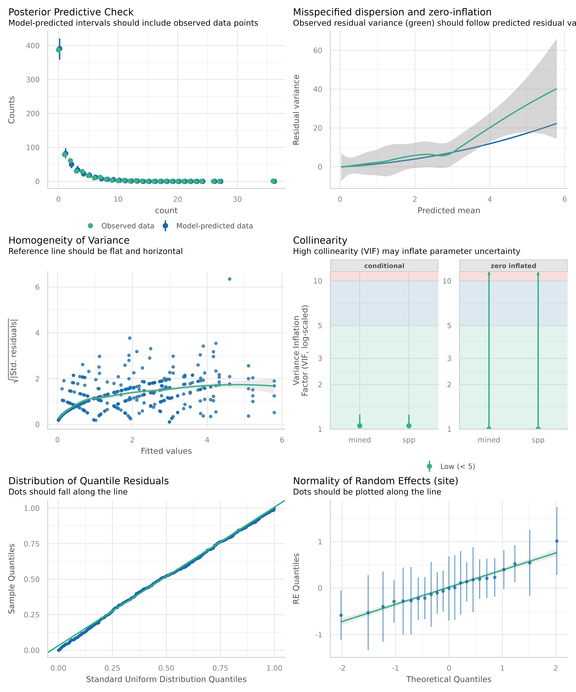
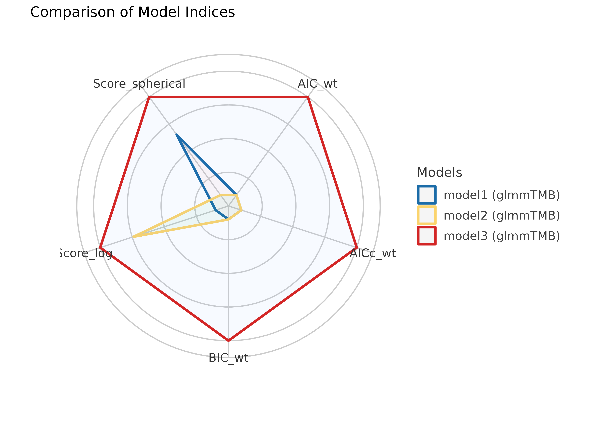
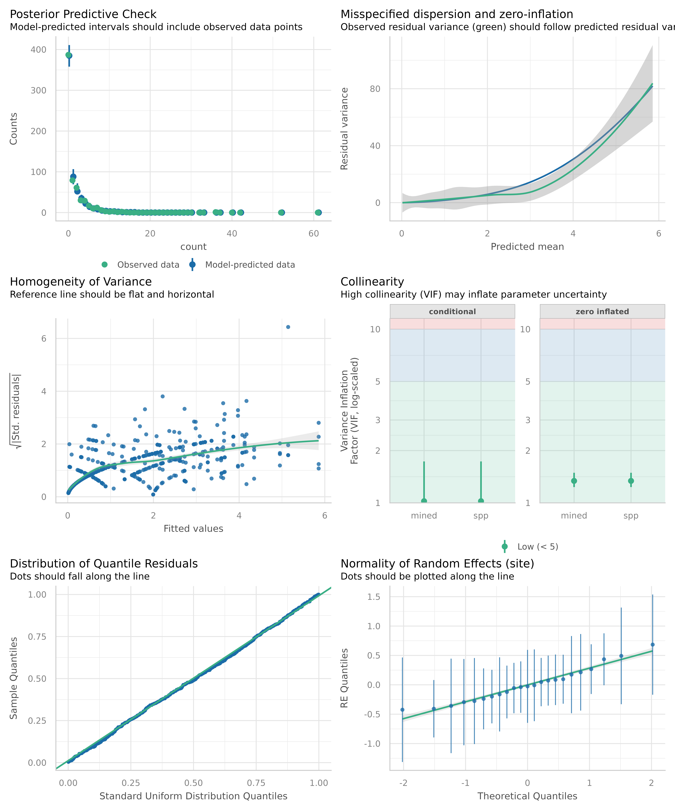

# Analytic workflow: Assessing model fit

This vignette shows how to use the [*performance*
package](https://easystats.github.io/performance/) to check the fit of a
model, how to detect misspecification and how to improve your model. The
basic workflow of the *performance* package can be summarized as
follows:

- fit a regression model
- check the model fit and assess model fit indices
- if necessary, fit another model that could potentially improve the fit
- compare the model fit indices and perform statistical tests to
  determine which model is the best fit


In the following, we will demonstrate this workflow using a model with a
count response variable. We will fit a Poisson regression model to the
Salamanders dataset from the *glmmTMB* package. The dataset contains
counts of salamanders in different sites, along with information on the
number of mines and the species of salamanders. We will check the model
fit and assess the model fit indices.

Problems that may arise with count response variables are *zero
inflation* and *overdispersion*. Zero inflation occurs when there are
more zeros in the data than expected under the Poisson distribution.
Overdispersion occurs when the variance of the data is greater than the
mean, which violates the assumption of equidispersion in the Poisson
distribution.

We will check for these problems and suggest ways to improve the model
fit, i.e. if necessary, we will fit another model that could potentially
improve the fit. Finally, we will compare the model fit indices and
perform statistical tests to determine which model is the best fit.

### Fit the initial model

We start with a generalized mixed effects model, using a Poisson
distribution.

``` r

library(performance)
model1 <- glmmTMB::glmmTMB(
  count ~ mined + spp + (1 | site),
  family = poisson,
  data = glmmTMB::Salamanders
)
```

First, let us look at the summary of the model.

``` r

library(parameters)
model_parameters(model1)
#> # Fixed Effects
#> 
#> Parameter   | Log-Mean |   SE |         95% CI |     z |      p
#> ---------------------------------------------------------------
#> (Intercept) |    -1.62 | 0.24 | [-2.10, -1.15] | -6.76 | < .001
#> mined [no]  |     2.26 | 0.28 | [ 1.72,  2.81] |  8.08 | < .001
#> spp [PR]    |    -1.39 | 0.22 | [-1.81, -0.96] | -6.44 | < .001
#> spp [DM]    |     0.23 | 0.13 | [-0.02,  0.48] |  1.79 | 0.074 
#> spp [EC-A]  |    -0.77 | 0.17 | [-1.11, -0.43] | -4.50 | < .001
#> spp [EC-L]  |     0.62 | 0.12 | [ 0.39,  0.86] |  5.21 | < .001
#> spp [DES-L] |     0.68 | 0.12 | [ 0.45,  0.91] |  5.75 | < .001
#> spp [DF]    |     0.08 | 0.13 | [-0.18,  0.34] |  0.60 | 0.549 
#> 
#> # Random Effects
#> 
#> Parameter            | Coefficient |       95% CI
#> -------------------------------------------------
#> SD (Intercept: site) |        0.58 | [0.38, 0.87]
#> 
#> Uncertainty intervals (equal-tailed) and p-values (two-tailed) computed
#>   using a Wald z-distribution approximation.
#> 
#> The model has a log- or logit-link. Consider using `exponentiate =
#>   TRUE` to interpret coefficients as ratios.
```

We see a lot of statistically significant estimates here. No matter,
which
[philosophy](https://easystats.github.io/parameters/reference/p_function.html)
you follow in terms of interpreting statistical test results, our
conclusions we draw from our regression models will be inaccurate if our
modeling assumptions are a poor fit for the situation. Hence, checking
model fit is essential.

In *performance*, we can conduct a comprehensive visual inspection of
our model fit using
[`check_model()`](https://easystats.github.io/performance/reference/check_model.html).
We won’t go into details of all the plots here, but you can find more
information on all created diagnostic plots in the [dedicated
vignette](https://easystats.github.io/performance/articles/check_model.html).

For now, we want to focus on the *posterior predictive checks*,
*dispersion and zero-inflation* as well as the Q-Q plot (*uniformity of
residuals*).

``` r

check_model(model1)
#> `check_outliers()` does not yet support models of class `glmmTMB`.
```



Note that unlike
[`plot()`](https://rdrr.io/r/graphics/plot.default.html), which is a
base R function to create diagnostic plots,
[`check_model()`](https://easystats.github.io/performance/reference/check_model.html)
relies on *simulated residuals* for the Q-Q plot, which is more accurate
for non-Gaussian models. See [this
vignette](https://easystats.github.io/performance/articles/simulate_residuals.html)
and the documentation of
[`simulate_residuals()`](https://easystats.github.io/performance/reference/simulate_residuals.html)
for further details.

The above plot suggests that we may have issues with overdispersion
and/or zero-inflation. We can check for these problems using
[`check_overdispersion()`](https://easystats.github.io/performance/reference/check_overdispersion.html)
and
[`check_zeroinflation()`](https://easystats.github.io/performance/reference/check_zeroinflation.html),
which will perform statistical tests (based on simulated residuals).
These tests can additionally be used beyond the visual inspection.

``` r

check_overdispersion(model1)
#> # Overdispersion test
#> 
#>        dispersion ratio =    2.324
#>   Pearson's Chi-Squared = 1475.875
#>                 p-value =  < 0.001
#> Overdispersion detected.

check_zeroinflation(model1)
#> # Check for zero-inflation
#> 
#>    Observed zeros: 387
#>   Predicted zeros: 311
#>             Ratio: 0.80
#> Model is underfitting zeros (probable zero-inflation).
```

As we can see, our model seems to suffer both from overdispersion and
zero-inflation.

### First attempt at improving the model fit

We can try to improve the model fit by fitting a model with
zero-inflation component:

``` r

model2 <- glmmTMB::glmmTMB(
  count ~ mined + spp + (1 | site),
  ziformula = ~ mined + spp,
  family = poisson,
  data = glmmTMB::Salamanders
)
check_model(model2)
#> `check_outliers()` does not yet support models of class `glmmTMB`.
```



Looking at the above plots, the zero-inflation seems to be addressed
properly (see especially *posterior predictive checks* and *uniformity
of residuals*, the Q-Q plot). However, the overdispersion still could be
present. We can check for these problems using
[`check_overdispersion()`](https://easystats.github.io/performance/reference/check_overdispersion.html)
and
[`check_zeroinflation()`](https://easystats.github.io/performance/reference/check_zeroinflation.html)
again.

``` r

check_overdispersion(model2)
#> # Overdispersion test
#> 
#>  dispersion ratio = 1.679
#>           p-value = 0.008
#> Overdispersion detected.

check_zeroinflation(model2)
#> # Check for zero-inflation
#> 
#>    Observed zeros: 387
#>   Predicted zeros: 387
#>             Ratio: 1.00
#> Model seems ok, ratio of observed and predicted zeros is within the
#>   tolerance range (p > .999).
```

Indeed, the overdispersion is still present.

### Second attempt at improving the model fit

We can try to address this issue by fitting a negative binomial model
instead of using a Poisson distribution.

``` r

model3 <- glmmTMB::glmmTMB(
  count ~ mined + spp + (1 | site),
  ziformula = ~ mined + spp,
  family = glmmTMB::nbinom1,
  data = glmmTMB::Salamanders
)
check_model(model3)
#> `check_outliers()` does not yet support models of class `glmmTMB`.
```



Now we see that the plot showing *misspecified dispersion and
zero-inflation* suggests that the overdispersion is better addressed
than before. Let us check again:

``` r

check_overdispersion(model3)
#> # Overdispersion test
#> 
#>  dispersion ratio = 1.081
#>           p-value =  0.54
#> No overdispersion detected.

check_zeroinflation(model3)
#> # Check for zero-inflation
#> 
#>    Observed zeros: 387
#>   Predicted zeros: 389
#>             Ratio: 1.00
#> Model seems ok, ratio of observed and predicted zeros is within the
#>   tolerance range (p > .999).
```

### Comparing model fit indices

There are different model fit indices that can be used to compare
models. For our purpose, we rely on the Akaike Information Criterion
(AIC), the corrected Akaike Information Criterion (AICc), the Bayesian
Information Criterion (BIC), and the Proper Scoring Rules. We can
compare the models using
[`compare_performance()`](https://easystats.github.io/performance/reference/compare_performance.html)
and [`plot()`](https://rdrr.io/r/graphics/plot.default.html).

``` r

result <- compare_performance(
  model1, model2, model3,
  metrics = c("AIC", "AICc", "BIC", "SCORE")
)
result
#> # Comparison of Model Performance Indices
#> 
#> Name   |   Model |  AIC (weights) | AICc (weights) |  BIC (weights) | Score_log | Score_spherical
#> -------------------------------------------------------------------------------------------------
#> model1 | glmmTMB | 1962.8 (<.001) | 1963.1 (<.001) | 2003.0 (<.001) |    -1.457 |           0.032
#> model2 | glmmTMB | 1785.5 (<.001) | 1786.5 (<.001) | 1861.4 (<.001) |    -1.328 |           0.032
#> model3 | glmmTMB | 1653.7 (>.999) | 1654.8 (>.999) | 1734.1 (>.999) |    -1.275 |           0.032

plot(result)
```



The weighted AIC and BIC range from 0 to 1, indicating better model fit
the closer the value is to 1. The AICc is a corrected version of the AIC
for small sample sizes. The Proper Scoring Rules range from -Inf to 0,
with higher values (i.e. closer to 0) indicating better model fit.

The above results suggest that indeed our third model is the best fit.

### Statistical tests for model comparison

We can also perform statistical tests to determine which model is the
best fit using
[`test_performance()`](https://easystats.github.io/performance/reference/test_performance.html)
or [`anova()`](https://rdrr.io/r/stats/anova.html).
[`test_performance()`](https://easystats.github.io/performance/reference/test_performance.html)
automatically selects an appropriate test based on the model family. You
can also call the different tests, like
[`test_likelihoodratio()`](https://easystats.github.io/performance/reference/test_performance.html),
[`test_bf()`](https://easystats.github.io/performance/reference/test_performance.html),
[`test_wald()`](https://easystats.github.io/performance/reference/test_performance.html)
or
[`test_vuong()`](https://easystats.github.io/performance/reference/test_performance.html)
directly.

``` r

test_performance(model1, model2, model3)
#> Name   |   Model |     BF | df | df_diff |   Chi2 |      p
#> ----------------------------------------------------------
#> model1 | glmmTMB |        |  9 |         |        |       
#> model2 | glmmTMB | > 1000 | 17 |       8 | 193.31 | < .001
#> model3 | glmmTMB | > 1000 | 18 |       1 | 133.83 | < .001
#> Models were detected as nested (in terms of fixed parameters) and are compared in sequential order.
```

We see, first, that
[`test_performance()`](https://easystats.github.io/performance/reference/test_performance.html)
used the Bayes factor (based on BIC comparison) to compare the models.
And second, that both the second and third model seem to be
significantly better than the first model.

Now we compare the second against the third model

``` r

test_performance(model2, model3)
#> Name   |   Model |     BF | df | df_diff |   Chi2 |      p
#> ----------------------------------------------------------
#> model2 | glmmTMB |        | 17 |         |        |       
#> model3 | glmmTMB | > 1000 | 18 |       1 | 133.83 | < .001
#> Models were detected as nested (in terms of fixed parameters) and are compared in sequential order.

test_likelihoodratio(model2, model3)
#> # Likelihood-Ratio-Test (LRT) for Model Comparison (ML-estimator)
#> 
#> Name   |   Model | df | df_diff |   Chi2 |      p
#> -------------------------------------------------
#> model2 | glmmTMB | 17 |         |        |       
#> model3 | glmmTMB | 18 |       1 | 133.83 | < .001
```

We see that both the Bayes factor and likelihood ratio test suggest that
the third model is significantly better than the second model.

What does this mean for our inference?

``` r

model_parameters(model3)
#> # Fixed Effects (Count Model)
#> 
#> Parameter   | Log-Mean |   SE |         95% CI |     z |      p
#> ---------------------------------------------------------------
#> (Intercept) |    -0.75 | 0.34 | [-1.40, -0.09] | -2.23 | 0.026 
#> mined [no]  |     1.56 | 0.33 | [ 0.92,  2.20] |  4.78 | < .001
#> spp [PR]    |    -1.57 | 0.30 | [-2.16, -0.97] | -5.15 | < .001
#> spp [DM]    |     0.07 | 0.20 | [-0.32,  0.46] |  0.34 | 0.735 
#> spp [EC-A]  |    -0.93 | 0.27 | [-1.45, -0.41] | -3.51 | < .001
#> spp [EC-L]  |     0.31 | 0.20 | [-0.07,  0.69] |  1.59 | 0.111 
#> spp [DES-L] |     0.41 | 0.19 | [ 0.04,  0.79] |  2.19 | 0.028 
#> spp [DF]    |    -0.12 | 0.20 | [-0.51,  0.28] | -0.57 | 0.568 
#> 
#> # Fixed Effects (Zero-Inflation Component)
#> 
#> Parameter   | Log-Odds |       SE |                 95% CI |         z |      p
#> -------------------------------------------------------------------------------
#> (Intercept) |     2.28 |     1.12 | [      0.08,     4.47] |      2.04 | 0.042 
#> mined [no]  |   -21.36 |  4655.41 | [  -9145.81,  9103.08] | -4.59e-03 | 0.996 
#> spp [PR]    |   -24.37 | 92198.78 | [ -1.81e+05, 1.81e+05] | -2.64e-04 | > .999
#> spp [DM]    |    -3.63 |     2.01 | [     -7.57,     0.31] |     -1.80 | 0.071 
#> spp [EC-A]  |    -2.79 |     1.95 | [     -6.61,     1.03] |     -1.43 | 0.152 
#> spp [EC-L]  |    -2.84 |     1.41 | [     -5.59,    -0.08] |     -2.02 | 0.044 
#> spp [DES-L] |    -3.56 |     1.78 | [     -7.04,    -0.07] |     -2.00 | 0.045 
#> spp [DF]    |   -20.55 |  4284.59 | [  -8418.20,  8377.09] | -4.80e-03 | 0.996 
#> 
#> # Dispersion
#> 
#> Parameter   | Coefficient |       95% CI
#> ----------------------------------------
#> (Intercept) |        2.02 | [1.54, 2.67]
#> 
#> # Random Effects Variances
#> 
#> Parameter            | Coefficient |       95% CI
#> -------------------------------------------------
#> SD (Intercept: site) |        0.46 | [0.27, 0.76]
#> 
#> Uncertainty intervals (equal-tailed) and p-values (two-tailed) computed
#>   using a Wald z-distribution approximation.
```

Obviously, although we might have found the best fitting model,
coefficients for the *zero-inflation* component of our model look rather
spurious. We have *very* high coefficients here. We still might find a
better distributional family for our model, and try `nbinom2` now.

``` r

model4 <- glmmTMB::glmmTMB(
  count ~ mined + spp + (1 | site),
  ziformula = ~ mined + spp,
  family = glmmTMB::nbinom2,
  data = glmmTMB::Salamanders
)
check_model(model4)
#> `check_outliers()` does not yet support models of class `glmmTMB`.
```



``` r


check_overdispersion(model4)
#> # Overdispersion test
#> 
#>  dispersion ratio = 0.958
#>           p-value =  0.93
#> No overdispersion detected.

check_zeroinflation(model4)
#> # Check for zero-inflation
#> 
#>    Observed zeros: 387
#>   Predicted zeros: 386
#>             Ratio: 1.00
#> Model seems ok, ratio of observed and predicted zeros is within the
#>   tolerance range (p = 0.952).

test_likelihoodratio(model3, model4)
#> Some of the nested models seem to be identical and probably only vary in
#>   their random effects.
#> # Likelihood-Ratio-Test (LRT) for Model Comparison (ML-estimator)
#> 
#> Name   |   Model | df | df_diff |  Chi2 |      p
#> ------------------------------------------------
#> model3 | glmmTMB | 18 |         |       |       
#> model4 | glmmTMB | 18 |       0 | 16.64 | < .001

model_parameters(model4)
#> # Fixed Effects (Count Model)
#> 
#> Parameter   | Log-Mean |   SE |        95% CI |     z |      p
#> --------------------------------------------------------------
#> (Intercept) |    -0.61 | 0.41 | [-1.40, 0.18] | -1.51 | 0.132 
#> mined [no]  |     1.43 | 0.37 | [ 0.71, 2.15] |  3.90 | < .001
#> spp [PR]    |    -0.96 | 0.64 | [-2.23, 0.30] | -1.50 | 0.134 
#> spp [DM]    |     0.17 | 0.24 | [-0.29, 0.63] |  0.73 | 0.468 
#> spp [EC-A]  |    -0.39 | 0.34 | [-1.06, 0.28] | -1.13 | 0.258 
#> spp [EC-L]  |     0.49 | 0.24 | [ 0.02, 0.96] |  2.05 | 0.041 
#> spp [DES-L] |     0.59 | 0.23 | [ 0.14, 1.04] |  2.59 | 0.010 
#> spp [DF]    |    -0.11 | 0.24 | [-0.59, 0.36] | -0.46 | 0.642 
#> 
#> # Fixed Effects (Zero-Inflation Component)
#> 
#> Parameter   | Log-Odds |   SE |         95% CI |     z |      p
#> ---------------------------------------------------------------
#> (Intercept) |     0.91 | 0.63 | [-0.32,  2.14] |  1.45 | 0.147 
#> mined [no]  |    -2.56 | 0.60 | [-3.75, -1.38] | -4.24 | < .001
#> spp [PR]    |     1.16 | 1.33 | [-1.45,  3.78] |  0.87 | 0.384 
#> spp [DM]    |    -0.94 | 0.80 | [-2.51,  0.63] | -1.17 | 0.241 
#> spp [EC-A]  |     1.04 | 0.71 | [-0.36,  2.44] |  1.46 | 0.144 
#> spp [EC-L]  |    -0.56 | 0.73 | [-1.99,  0.86] | -0.77 | 0.439 
#> spp [DES-L] |    -0.89 | 0.75 | [-2.37,  0.58] | -1.19 | 0.236 
#> spp [DF]    |    -2.54 | 2.18 | [-6.82,  1.74] | -1.16 | 0.244 
#> 
#> # Dispersion
#> 
#> Parameter   | Coefficient |       95% CI
#> ----------------------------------------
#> (Intercept) |        1.51 | [0.93, 2.46]
#> 
#> # Random Effects Variances
#> 
#> Parameter            | Coefficient |       95% CI
#> -------------------------------------------------
#> SD (Intercept: site) |        0.38 | [0.17, 0.87]
#> 
#> Uncertainty intervals (equal-tailed) and p-values (two-tailed) computed
#>   using a Wald z-distribution approximation.
```

Based on these results, we might even go with `model4`.

## Conclusion

Statistics is hard. It is not just about fitting a model, but also about
checking the model fit and improving the model. This also requires
domain knowledge to consider whether all relevant predictors are
included in the model (and whether all included predictors are
relevant!).

The *performance* package provides a comprehensive set of tools to help
you with this task. We have demonstrated how to use these tools to check
the fit of a model, detect misspecification, and improve the model. We
have also shown how to compare the model fit indices and perform
statistical tests to determine which model is the best fit. We hope this
vignette has been helpful in guiding you through this process.
