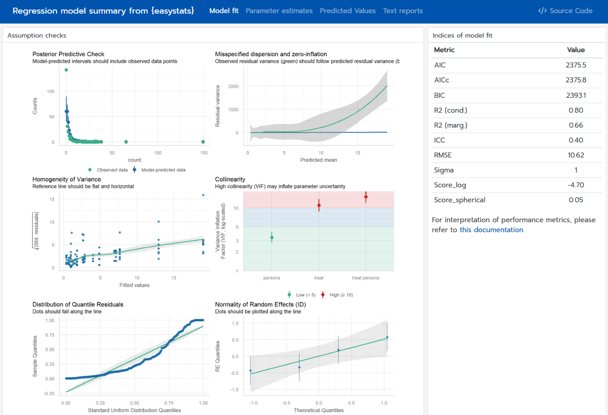

```{r, warning=FALSE, message=FALSE, echo=FALSE}
knitr::opts_chunk$set(
  collapse = TRUE,
  out.width = "100%",
  dpi = 450,
  comment = "#>",
  fig.width = 6,
  fig.height = 4,
  message = FALSE,
  warning = FALSE
)

options(modelbased_join_dots = FALSE)
```

# Summary

The **easystats** project is a collection of R packages that provides a unified and intuitive framework for data wrangling and statistical analysis. They implement functionalities designed to be *user-friendly* (e.g., transparent names of functions and arguments, comprehensive documentation, sensible defaults), *consistent* (similar syntax and design principles across packages), and *interoperable* (seamless integration between packages).

The packages are specialized for different stages of the statistical workflow, such as data wrangling [`{datawizard}`, @patil_datawizard_2022], model assessment [`{performance}`, @Lüdecke2020performance], understanding and describing model parameters [`{parameters}`, @Lüdecke2020parameters], including Bayesian models [`{bayestestR}`, @Makowski2019; @makowski2019indices], computation of effect sizes [`{effectsize}`, @Ben-Shachar2020], calculating and visualizing marginal effects [`{modelbased}`, @Makowski2025modelbased], and generating publication-ready figures [`{see}`, @ludecke_see_2021] or reports of statistical models [`{report}`, @report_remi_2023].


# Statement of Need

R is a powerful language for statistical computing, but its capabilities are scattered across a fragmented landscape of packages. Conducting a full analysis consisting of data manipulation, modeling, diagnostics, interpretation, and visualization, often requires juggling multiple tools with different syntax, design principles, outputs, and classes. This creates barriers for newcomers and inefficiencies even for experienced users.

The **easystats** ecosystem addresses this challenge by enabling a seamless workflow from data exploration to result communication, while nudging users toward good, reproducible and transparent statistical practices with sensible defaults and clear documentation. The packages in this ecosystem share consistent syntax and integrate seamlessly, making robust analysis more accessible while reducing cognitive load for novice and experienced R users alike.

The modular and lightweight nature of the **easystats** ecosystem enables developers to use and integrate in other packages only the necessary components. For example, `{insight}`, a dependency-free package for retrieving model information, is utilized by 45 other CRAN packages, such as `{marginaleffects}` [@arel-bundock_how_2024] and `{gtsummary}` [@gtsummary2021]. In contrast, the `{easystats}` meta-package provides users with a cohesive experience, granting access to the entire ecosystem and its consistent design principles without needing to know the specific package of each function.


# State of the field

Other R ecosystems or packages often serve different purposes. The `{tidyverse}` [@Wickham2019], for example, provides foundational framework for data manipulation and visualisation but does not focus on the intricacies of statistical model interpretation and reporting. Specialist packages like `{lme4}` [@bates_fitting_2015] for mixed-effects models or `{brms}` [@burkner2017brms] for Bayesian analysis are essential tools, but **easystats** serves as a complementary meta-layer that provides a single, easy-to-learn interface for interacting with the outputs from these and many other modeling packages. This allows analysts and researchers to focus on scientific questions rather than the technical idiosyncrasies of software implementations. **easystats** meets a critical need when doing statistics in R by delivering a coherent, intuitive suite of tools that span the statistical modeling pipeline.


# Software design: A Harmonized and Integrated Workflow

A key design principle of the **easystats** ecosystem is the harmonization and integration of different packages into a simple, sequential workflow. The typical workflow for a statistical analysis using `{easystats}` starts with importing data and bringing the data into shape for the next step—fitting a model—and then sequentially using different functions to obtain a comprehensive understanding of the model. This can include checking the model's parameters, performance metrics, specific effect sizes [e.g., @ben2023phi], and statistical outliers [@theriault2024check], as well as obtaining publication-ready figures and written summaries of the results.

Let's demonstrate this with an example, where the user wants to fit a mixed effects model:

```{r}
# we don't load each package individually,
# but rather the entire ecosystem
library(easystats)
data(fish, package = "modelbased")

# rename variable
fish <- data_rename(fish, select = c(treat = "camper"))

# fit mixed model
model <- glmmTMB::glmmTMB(
  count ~ treat * persons + (1 | ID),
  data = fish,
  family = poisson()
)
```

The `model` object can then be passed to functions from different **easystats** packages. For instance, the user can get a summary of the model parameters using the `{parameters}` package:

```{r}
model_parameters(model)
```

Then, the performance of the model can be assessed with the `{performance}` package:

```{r}
model_performance(
  model,
  metrics = c("AIC", "BIC", "R2")
)
```

The results can be visualized using the `{see}` package by, for example, plotting the model's predictions from `{modelbased}` (Figure 1):

```{r fig1, fig.cap = "Predicted probability of alertness by treatment group."}
predictions <- estimate_means(model, c("persons", "treat"))
plot(predictions) +
  theme_modern(show.ticks = TRUE) + # add nice theme
  scale_color_material() # add some nice colors
```

Finally, a full report of the analysis can be generated with the `{report}` package:

```{r, echo = F}
options(width = 69)
```

```{r}
report(model)
```

The `model_dashboard()` function generates an interactive model summary, integrating several **easystats** steps into a single command. Since this paper is a static document, Figure 2 provides a static screenshot of the interactive report.

{width=100%}

This seamless integration between **easystats** packages allows users to move from model fitting and interpretation to visualization and reporting in a fluid and intuitive way, without having to learn different syntaxes, data structures, or idiosyncratic software design choices.

To get the newest features from the rapidly developing **easystats** ecosystem, users can run `easystats::install_latest()`. It conveniently installs the latest development version of every package in the project.

# Research impact statement

The **easystats** ecosystem has a substantial realized impact across the scientific community, as shown by the high citation counts of its related publications only from the Journal of Open Source Software (Table 1). For example, the `{performance}` and `{bayestestR}` packages alone have over 6,000 and 1,600 citations, respectively (statistic from February 2026). Because a typical analysis leverages multiple **easystats** packages sequentially throughout the statistical workflow, this meta-package paper provides researchers with a single, unified citation to streamline referencing and to avoid the need for excessive citations.

```{r eval=FALSE}
easystats_citations()
```
```{r table1, echo=FALSE}
out <- easystats_citations(length = 50)
out |>
  data_filter(grepl("^Journal of Open Source", Journal)) |>
  data_select(exclude = "Journal") |>
  print_md(caption = "Citations of easystats papers published in JOSS")
```


# Licensing and Availability

The release version of `{easystats}` is available for download from [CRAN](https://doi.org/10.32614/CRAN.package.easystats), whereas development versions are available from the [R-universe](https://easystats.r-universe.dev/easystats) and [GitHub](https://github.com/easystats/easystats/). The package is licensed under the MIT-License, with all source code stored at GitHub (<https://github.com/easystats/easystats>), with a corresponding issue tracker for bug reporting and feature enhancements. In the spirit of honest and open science, we encourage requests, tips for fixes, feature updates, as well as general questions and concerns via direct interaction with contributors and developers.

# AI usage disclosure

No generative AI was used in software creation, writing the documentation or the paper.


# Acknowledgments

`{easystats}` is part of the collaborative [**easystats** ecosystem](https://easystats.github.io/easystats/). Thus, we thank all [members of easystats](https://github.com/orgs/easystats/people), contributors, and users alike.

# References
