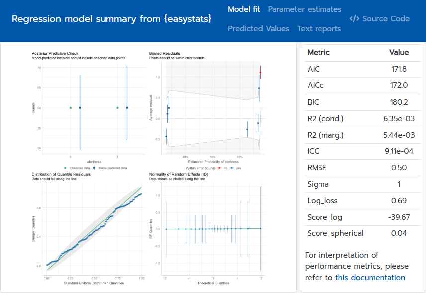

# Summary

The **easystats** project is a collection of R packages that provides a unified and intuitive framework for data wrangling and statistical analysis. The ecosystem is built around a philosophy of consistency, user-friendliness, and interoperability between packages, similar to the `{tidyverse}` [@Wickham2019]. It aims to simplify the process of preparing, conducting, interpreting, and reporting statistical analyses by offering tools for a wide range of common tasks. These tasks include, for instance, data wrangling [`{datawizard}`, @patil_datawizard_2022], model assessment [`{performance}`, @Lüdecke2020performance], understanding and describing model parameters [`{parameters}`, @Lüdecke2020parameters], including Bayesian models [`{bayestestR}`, @Makowski2019; @makowski2019indices], computation of effect sizes [`{effectsize}`, @Ben-Shachar2020], calculating and visualizing marginal effects [`{modelbased}`, @Makowski2025modelbased], and generating publication-ready figures [`{see}`, @ludecke_see_2021] or reports of statistical models [`{report}`, @report_remi_2023]. The **easystats** ecosystem is designed to be accessible to both novice and experienced R users, promoting reproducible research and a more seamless workflow from data exploration to result communication.

# Statement of Need

R is a powerful language for statistical computing, but its capabilities are scattered across a fragmented ecosystem of packages. Conducting a full analysis consisting of modeling, diagnostics, interpretation, and visualization, often requires juggling multiple tools with different syntax, design principles, outputs, and classes. This creates barriers for newcomers and inefficiencies even for experienced users.

The **easystats** ecosystem addresses this challenge by providing a unified framework for wrangling, exploration, modeling, visualization, and reporting in R, while nudging users toward good and transparent statistical practices with sensible defaults and clear documentation. Its lightweight, interoperable packages focus on different stages of the statistical workflow, and share consistent syntax and integrate seamlessly, making robust analysis more accessible while reducing cognitive load.

Other software toolkits often serve different purposes. The `{tidyverse}` [@Wickham2019], for example, provides a world-class environment for data manipulation and general-purpose plotting but does not focus on the intricacies of statistical model interpretation and reporting. Specialist packages like `{lme4}` [@bates_fitting_2015] for mixed-effects models or `{marginaleffects}` [@arel-bundock_how_2024] for marginal effects and predictions are essential tools, but **easystats** serves as a complementary meta-layer that provides a single, easy-to-learn interface for interacting with the outputs from these and many other modeling packages. This allows analysts and researchers to focus on scientific questions rather than the technical idiosyncrasies of software implementations. **easystats** meets a critical need when doing statistics in R by delivering a coherent, intuitive suite of tools that span the statistical modeling pipeline.

The modularity of the **easystats** packages enables developers to select and use only the necessary components. For example, `{insight}`, a dependency-free package for retrieving model information, is utilized by 45 other CRAN packages, and `{parameters}` is used by 22. In contrast, the `{easystats}` meta-package [@easystatspackage] provides users with a cohesive experience, granting access to the entire ecosystem and its consistent design principles without needing to know the specific package of each function.

# A Harmonized and Integrated Workflow

A key design principle of the **easystats** ecosystem is the harmonization and integration of different packages into a simple, sequential workflow. The typical workflow for a statistical analysis using `{easystats}` starts with importing data and bringing the data into shape for the next step—fitting a model—and then sequentially using different functions to obtain a comprehensive understanding of the model. This can include checking the model's parameters, performance metrics, specific effect sizes [e.g., @ben2023phi], and statistical outliers [@theriault2024check], as well as obtaining publication-ready figures and written summaries of the results.

Let's demonstrate this with an example, where the user starts by preparing some data and then fits a logistic mixed effects model:


``` r
# we don't load each package individually,
# but rather the entire ecosystem
library(easystats)
data(coffee_data, package = "modelbased")

# dichotomize outcome variable
coffee_data$alertness <- categorize(coffee_data$alertness, lowest = 0)

# rename variable
coffee_data <- data_rename(coffee_data, select = c(treatment = "coffee"))

# fit mixed model
model <- glmmTMB::glmmTMB(
  alertness ~ treatment + (1 | ID),
  data = coffee_data,
  family = binomial()
)
```

The `model` object can then be passed to functions from different **easystats** packages. For instance, the user can get a summary of the model parameters using the `{parameters}` package:


``` r
model_parameters(model)
#> # Fixed Effects
#> 
#> Parameter           | Log-Odds |   SE |        95% CI |     z |     p
#> ---------------------------------------------------------------------
#> (Intercept)         |     0.13 | 0.26 | [-0.37, 0.64] |  0.52 | 0.606
#> treatment [control] |    -0.27 | 0.37 | [-0.99, 0.45] | -0.73 | 0.466
#> 
#> # Random Effects
#> 
#> Parameter          | Coefficient |           95% CI
#> ---------------------------------------------------
#> SD (Intercept: ID) |        0.05 | [0.00, 9.86e+28]
```

Then, the performance of the model can be assessed with the `{performance}` package:


``` r
model_performance(
  model,
  metrics = c("AIC", "BIC", "R2")
)
#> # Indices of model performance
#> 
#> AIC   |   BIC | R2 (cond.) | R2 (marg.)
#> ---------------------------------------
#> 171.8 | 180.2 |      0.006 |      0.005
```

The results can be visualized using the `{see}` package by, for example, plotting the model's predictions from `{modelbased}`:


``` r
predictions <- estimate_means(model, "treatment")
plot(predictions) + theme_modern(show.ticks = TRUE) # add nice theme
```

\begin{figure}
\includegraphics[width=1\linewidth]{paper_files/figure-latex/fig1-1} \caption{Predicted probability of alertness by treatment group.}\label{fig:fig1}
\end{figure}

Finally, a full report of the analysis can be generated with the `{report}` package:


``` r
report(model)
#> We fitted a logistic mixed model (estimated using ML and nlminb
#> optimizer) to predict alertness with treatment (formula: alertness ~
#> treatment). The model included ID as random effect (formula: ~1 |
#> ID). The model's total explanatory power is very weak (conditional
#> R2 = 6.35e-03) and the part related to the fixed effects alone
#> (marginal R2) is of 5.44e-03. The model's intercept, corresponding
#> to treatment = coffee, is at 0.13 (95% CI [-0.37, 0.64], p = 0.606).
#> Within this model:
#> 
#>   - The effect of treatment [control] is statistically non-significant
#> and negative (beta = -0.27, 95% CI [-0.99, 0.45], p = 0.466; Std.
#> beta = -0.27, 95% CI [-0.99, 0.45])
#> 
#> Standardized parameters were obtained by fitting the model on a
#> standardized version of the dataset. 95% Confidence Intervals (CIs)
#> and p-values were computed using a Wald z-distribution
#> approximation.
```

This static paper does not allow us to run an interactive demonstration of the `model_dashboard()` function, but this function automatically generates a dashboard presenting an interactive model summary that harmoniously integrates several of the other **easystats** steps described earlier in a single command.

{width=100%}

This seamless integration between **easystats** packages allows users to move from model fitting and interpretation to visualization and reporting in a fluid and intuitive way, without having to learn different syntaxes, data structures, or idiosyncratic software design choices.

# Licensing and Availability

`{easystats}` is licensed under the MIT-License, with all source code stored at GitHub (<https://github.com/easystats/easystats>), and with a corresponding issue tracker for bug reporting and feature enhancements. In the spirit of honest and open science, we encourage requests, tips for fixes, feature updates, as well as general questions and concerns via direct interaction with contributors and developers.

# Acknowledgments

`{easystats}` is part of the collaborative [**easystats** ecosystem](https://easystats.github.io/easystats/). Thus, we thank all [members of easystats](https://github.com/orgs/easystats/people), contributors, and users alike.

# References
