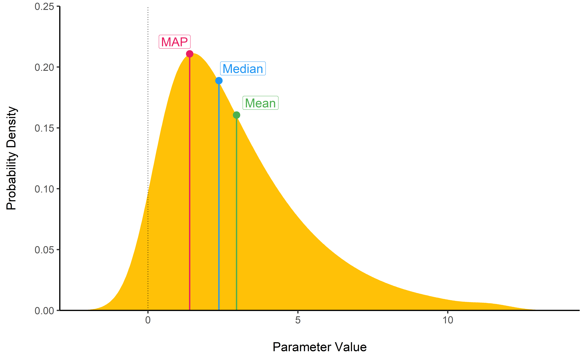
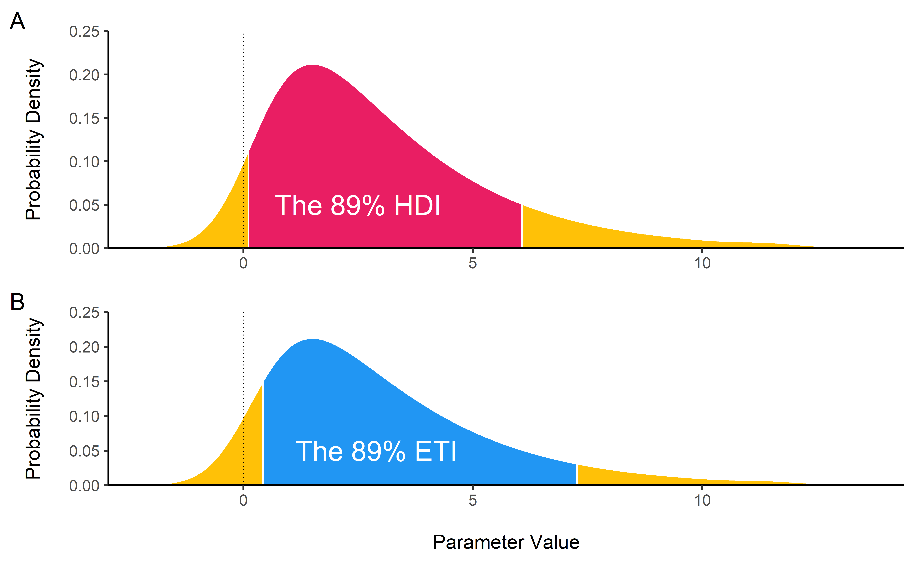
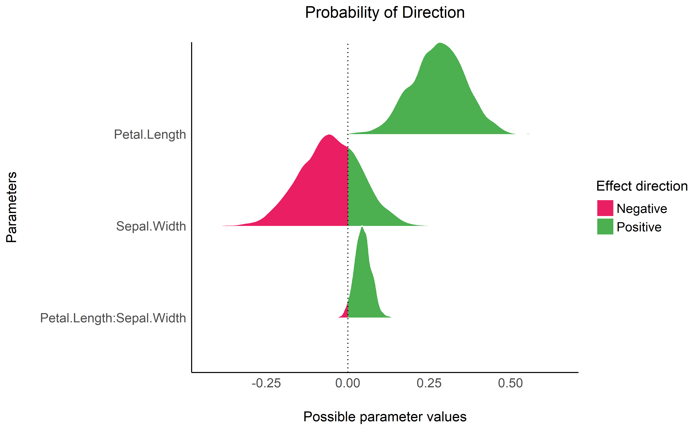

# Introduction

The Bayesian framework for statistics is quickly gaining in popularity among scientists, for reasons such as reliability and accuracy (particularly in noisy data and small samples), the possibility of incorporating prior knowledge into the analysis, and the intuitive interpretation of results [@andrews2013prior; @etz2016bayesian; @kruschke2010believe; @kruschke2012time; @wagenmakers2018bayesian]. Adopting the Bayesian framework is more of a shift in the paradigm than a change in the methodology; all the common statistical procedures (*t*-tests, correlations, ANOVAs, regressions, etc.) can also be achieved within the Bayesian framework. One of the core difference is that in the *frequentist* view, the effects are fixed (but unknown) and data are random. On the other hand, instead of having single estimates of the "true effect", the Bayesian inference process computes the probability of different effects *given the observed data*, resulting in a distribution of possible values for the parameters, called the *posterior distribution*. The **bayestestR** package provides tools to describe these posterior distributions.

Effects in the Bayesian framework can be described by [characterizing their posterior distribution](https://easystats.github.io/bayestestR/articles/guidelines.html). Commonly reported indices include measures of centrality (e.g., the median, mean or MAP estimate) and uncertainty (the [*credible* interval](https://easystats.github.io/bayestestR/articles/credible_interval.html) - CI). With caution, these can be considered the counterparts to the coefficient point-estimates and confidence intervals of the frequentist framework. Additionally, **bayestestR** also focuses on implementing a Bayesian null-hypothesis testing framework (in a Bayesian sense, i.e., extended to general testing of "effect existence") by providing access to both established and exploratory indices of effect *existence* and *significance* [such as the ROPE, @kruschke2018bayesian; the MAP-based *p*-value, @mills2018objective; the Bayes factor, @morey2011bayes; or the Probability of Direction - *pd*].

Existing R packages allow users to easily fit a large variety of models and extract and visualize the posterior draws. However, most of these packages only return a limited set of indices (e.g., point-estimates and CIs). **bayestestR** provides a comprehensive and consistent set of functions to analyze and describe posterior distributions generated by a variety of models objects, including popular modeling packages such as **rstanarm** [@goodrich2018rstanarm], **brms** [@burkner2017brms], **BayesFactor** [@morey2018bayesfactor], and **emmeans** [@lenth2019emmeans], thus making it a useful tool supporting the usage and development of Bayesian statistics. The main functions are described below, and full documentation is available on the [package's website](https://easystats.github.io/bayestestR).

# Examples of Features

The following demonstration of functions is accompanied by figures to illustrate the conceptional ideas behind the related indices. However, **bayestestR** functions also include plotting capabilities via the [**see** package](https://easystats.github.io/see/) [@ludecke2019see].

## Indices of Centrality: Point-estimates

**bayestestR** offers two functions to compute point-estimates from posterior distributions: `map_estimate()` and `point_estimate()`, the latter providing options to calculate the mean, median or MAP estimate of a posterior distribution (see **Figure 1**). [`map_estimate()`](https://easystats.github.io/bayestestR/reference/map_estimate.html) is a convenient function to calculate the **Maximum A Posteriori** (MAP) estimate directly.

The **posterior mean** minimizes expected _squared_ error, whereas the **posterior median** minimizes expected _absolute_ error (i.e., the difference of estimates from true values over samples). The **MAP estimate** corresponds to the most probable value of a posterior distribution.

``` r
set.seed(1)
posterior <- rchisq(100, 3)
map_estimate(posterior)

#> MAP = 1.46

point_estimate(posterior)

#> Median = 2.31

point_estimate(posterior, centrality = "mean")

#> Mean = 2.96

point_estimate(posterior, centrality = "map")

#> MAP = 1.46
```



## Quantifying Uncertainty: The Credible Interval (CI)

In order to measure the uncertainty associated with the estimation, **bayestestR** provides two functions: `eti()`, the **Equal-Tailed Interval (ETI)**, and `hdi()`, the **Highest Density Interval (HDI)**. Both indices (accessible via the `method` argument in the `ci()` function) can be used in the context of Bayesian posterior characterisation as **Credible Interval (CI)**.

[`hdi()`](https://easystats.github.io/bayestestR/reference/hdi.html)
computes the HDI of a posterior distribution, i.e., the interval that contains all points within the interval having a higher probability density than points outside the interval (see **Figure 2**). HDIs have a particular property: Unlike an equal-tailed interval (computed by [`eti()`](https://easystats.github.io/bayestestR/reference/eti.html)) that typically excludes 2.5% from each tail of the distribution, the HDI is *not* equal-tailed and therefore always includes the mode(s) of posterior distributions.

By default, `hdi()` and `eti()` return the 89% intervals (`ci = 0.89`), deemed to be more stable than, for instance, 95% intervals. An effective sample size of at least 10.000 is recommended if 95% intervals should be computed [@kruschke2015doing]. Moreover, 89 indicates the arbitrariness of interval limits - its only remarkable property is being the highest prime number that does not exceed the already unstable 95\% threshold [@mcelreath2018statistical].

``` r
hdi(posterior)

#> # Highest Density Interval
#> 
#>       89% HDI
#>  [0.11, 6.05]

eti(posterior)

#> # Equal-Tailed Interval
#> 
#>       89% ETI
#>  [0.42, 7.27]
```



## Null-Hypothesis Significance Testing (NHST)

The Bayesian framework allows one to neatly delineate and quantify different aspects of hypothesis testing, including effect *existence* and *significance*, and different indices have been developed to describe them.


### ROPE and Test for Practical Equivalence

[`rope()`](https://easystats.github.io/bayestestR/reference/rope.html) computes the proportion of the HDI (default to the 89% HDI) of a posterior distribution that lies within a Region Of Practical Equivalence (the **ROPE**; see **Figure 3**, panel A).

Statistically, the probability of a posterior distribution being different than 0 does not make much sense (the probability of it being different from a single point being infinite). Therefore, the idea underlining ROPE is to let the user define an area around the null value enclosing values that are *equivalent to the null* value for practical purposes [@kruschke2018bayesian; @kruschke2018rejecting]. In the absence of user-provided values, **bayestestR** will automatically find an appropriate range for the ROPE using the  [`rope_range()`](https://easystats.github.io/bayestestR/reference/rope_range.html) function.

``` r
rope(distribution_normal(1000, mean = 1), range = c(-0.5, 0.5))

#> # Proportion of samples inside the ROPE [-0.50, 0.50]:
#> 
#>  inside ROPE
#>      27.16 %
```


The proportion of HDI lying within this "null" region can be used as an decision criterion for "null-hypothesis" testing. Such a **Test for Practical Equivalence**, implemented via [`equivalence_test()`](https://easystats.github.io/bayestestR/reference/equivalence_test.html), is based on the “HDI+ROPE decision rule” [@kruschke2018rejecting] to check whether parameter values should be accepted or rejected against an explicitly formulated “null hypothesis” (i.e., a [ROPE](https://easystats.github.io/bayestestR/reference/rope.html)). If the HDI is completely outside the ROPE, the "null hypothesis" for this parameter is "rejected". If the ROPE completely covers the HDI, i.e., all most credible values of a parameter are inside the ROPE, the null hypothesis is accepted. Otherwise, whether to accept or reject the null hypothesis is undecided.

``` r
library(rstanarm)
model <- stan_glm(mpg ~ wt + gear, data = mtcars)
equivalence_test(model)

#> # Test for Practical Equivalence
#> 
#>   ROPE: [-0.60 0.60]
#> 
#>    Parameter        H0 inside ROPE       89% HDI
#>  (Intercept)  Rejected      0.00 % [30.82 47.02]
#>           wt  Rejected      0.00 % [-6.63 -4.39]
#>         gear Undecided     52.54 % [-1.76  1.23]
```


### Probability of Direction (*pd*)

[`p_direction()`](https://easystats.github.io/bayestestR/reference/p_direction.html) computes the **Probability of Direction** (*pd*, also known as the Maximum Probability of Effect - *MPE*). This index of effect existence varies between 50% and 100% and can be interpreted as the probability that a parameter (described by its posterior distribution) is strictly positive or negative (whichever is the most probable). It is mathematically defined as the proportion of the posterior distribution that is of the median's sign (see **Figure 3**, panel B).

``` r
p_direction(distribution_normal(100, 0.4, 0.2))

#> # Probability of Direction (pd)
#> 
#> pd = 98.00%
```

### Bayes Factor

[**`bayesfactor_parameters()`**](https://easystats.github.io/bayestestR/reference/bayesfactor_parameters.html) computes Bayes factors against the null (either a point or an interval), based on prior and posterior samples of a single parameter. This Bayes factor indicates the degree by which the mass of the posterior distribution has shifted further away from or closer to the null value(s) (relative to the prior distribution), thus indicating if the null value has become less or more likely given the observed data. 

When the null is an interval, the Bayes factor is computed by comparing the prior and posterior odds of the parameter falling within or outside the null; when the null is a point, a Savage-Dickey density ratio is computed, which is also an approximation of a Bayes factor comparing the marginal likelihoods of the model against a model in which the tested parameter has been restricted to the point null [@wagenmakers2010bayesian]. 

``` r
prior <- distribution_normal(1000, mean = 0, sd = 1)
posterior <- distribution_normal(1000, mean = 1, sd = 0.7)

bayesfactor_parameters(posterior, prior, direction = "two-sided", null = 0)

#> # Bayes Factor (Savage-Dickey density ratio)
#> 
#>  Bayes Factor
#>          1.98
#> 
#> * Evidence Against The Null: [0]
```

### MAP-based *p*-value

[`p_map()`](https://easystats.github.io/bayestestR/reference/p_map.html) computes the odds that a parameter (described by its posterior distribution) has against the null hypothesis (*h0*) using Mills’ *Objective Bayesian Hypothesis Testing* framework [@mills2018objective; @mills2014bayesian]. It corresponds to the density value at 0 divided by the density at the MAP - the Maximum A Posteriori (see **Figure 3**, panel D).

``` r
p_map(distribution_normal(1000, mean = 1))
#> # MAP-based p-value
#> 
#> p (MAP) = 0.629
```

## Visualisation and Compatibility with Models


Most of bayestestR functions can be visualised (see **Figure 4**) by passing them to the `plot()` function (the [**see**](https://github.com/easystats/see) package needs to be installed). Moreover, these functions can be directly applied to statistical models (fitted for instance with **rstanarm** or **brms**), resulting in the description of the parameters of the model.


``` r
# Load the rstanarm and the see package
library(rstanarm)
library(see)

# Fit a Bayesian linear regression
model <- stan_glm(Petal.Width ~ Petal.Length * Sepal.Width, data = iris)

# Store results
result_pd <- p_direction(model)

# Print and plot results
print(result_pd)

# Probability of Direction (pd)

                Parameter     pd
              (Intercept) 72.47%
             Petal.Length 99.88%
              Sepal.Width 70.97%
 Petal.Length:Sepal.Width 96.70%

plot(result_pd)
```




# Licensing and Availability

**bayestestR** is licensed under the GNU General Public License (v3.0), with all source code stored at GitHub (https://github.com/easystats/bayestestR), and with a corresponding issue tracker for bug reporting and feature enhancements. In the spirit of honest and open science, we encourage requests/tips for fixes, feature updates, as well as general questions and concerns via direct interaction with contributors and developers.

# Acknowledgments

**bayestestR** is part of the [*easystats*](https://github.com/easystats/easystats) ecosystem [relying on the **insight** package to access information contained in models; @ludecke2019insight], a collaborative project created to facilitate the usage of R. Thus, we would like to thank the [council of masters](https://github.com/orgs/easystats/people) of easystats, all other padawan contributors, as well as the users.

# References
