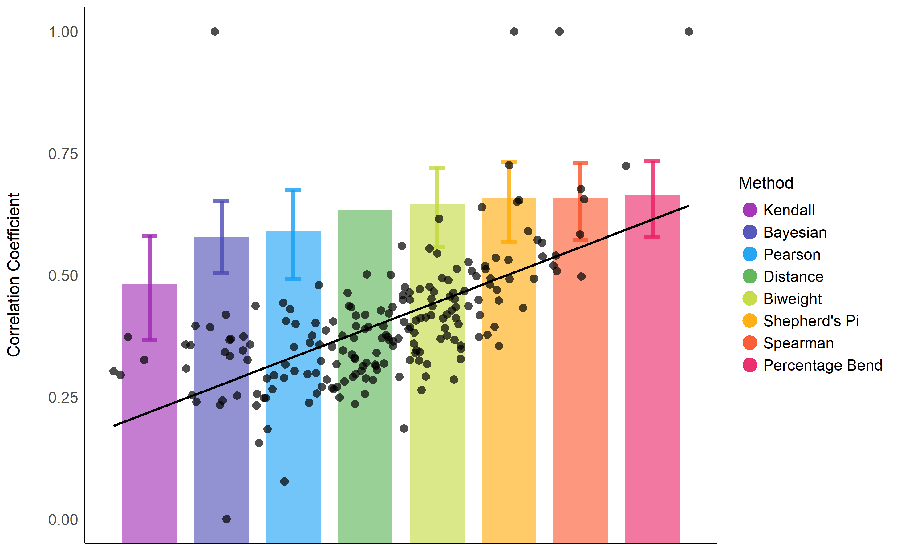

# Introduction

Correlations tests are arguably one of the most commonly used statistical procedures, and are used as a basis in many applications such as exploratory data analysis, structural modelling, data engineering etc. In this context, we present **correlation**, a toolbox for the R language [@Rteam] and part of the [**easystats**](https://github.com/easystats/easystats) collection, focused on correlation analysis. Its goal is to be lightweight, easy to use, and allows for the computation of many different kinds of correlations, such as:

- **Pearson's correlation**: This is the most common correlation method. It corresponds to the covariance of the two variables normalized (i.e., divided) by the product of their standard deviations.

$$r_{xy} = \frac{cov(x,y)}{SD_x \times SD_y}$$

- **Spearman's rank correlation**: A non-parametric measure of correlation, the Spearman correlation between two variables is equal to the Pearson correlation between the rank scores of those two variables; while Pearson's correlation assesses linear relationships, Spearman's correlation assesses monotonic relationships (whether linear or not). Confidence Intervals (CI) for Spearman's correlations are computed using the @fieller1957tests correction [see @bishara2017confidence].

$$r_{s_{xy}} = \frac{cov(rank_x, rank_y)}{SD(rank_x) \times SD(rank_y)}$$

- **Kendall's rank correlation**: In the normal case, the Kendall correlation is preferred to the Spearman correlation because of a smaller gross error sensitivity (GES) and a smaller asymptotic variance (AV), making it more robust and more efficient. However, the interpretation of Kendall's tau is less direct compared to that of the Spearman's rho, in the sense that it quantifies the difference between the % of concordant and discordant pairs among all possible pairwise events. Confidence Intervals (CI) for Kendall's correlations are computed using the @fieller1957tests correction [see @bishara2017confidence]. For each pair of observations (i ,j) of two variables (x, y), it is defined as follows:

$$\tau_{xy} = \frac{2}{n(n-1)}\sum_{i<j}^{}sign(x_i - x_j) \times sign(y_i - y_j)$$

- **Biweight midcorrelation**: A measure of similarity that is median-based, instead of the traditional mean-based, thus being less sensitive to outliers. It can be used as a robust alternative to other similarity metrics, such as Pearson correlation [@langfelder2012fast].

- **Distance correlation**: Distance correlation measures both linear and non-linear association between two random variables or random vectors. This is in contrast to Pearson's correlation, which can only detect linear association between two random variables.

- **Percentage bend correlation**: Introduced by Wilcox (1994), it is based on a down-weight of a specified percentage of marginal observations deviating from the median (by default, 20 percent).

- **Shepherd's Pi correlation**: Equivalent to a Spearman's rank correlation after outliers removal (by means of bootstrapped Mahalanobis distance).

- **Point-Biserial and biserial correlation**: Correlation coefficient used when one variable is continuous and the other is dichotomous (binary). Point-Biserial is equivalent to a Pearson's correlation, while Biserial should be used when the binary variable is assumed to have an underlying continuity. For example, anxiety level can be measured on a continuous scale, but can be classified dichotomously as high/low.

- **Polychoric correlation**: Correlation between two theorised normally distributed continuous latent variables, from two observed ordinal variables.

- **Tetrachoric correlation**: Special case of the polychoric correlation applicable when both observed variables are dichotomous.

- **Partial correlation**: Correlation between two variables after adjusting for the (linear) the effect of one or more variables. The correlation test is here run after having partialized the dataset, independently from it. In other words, it considers partialization as an independent step generating a different dataset, rather than belonging to the same model. This is why some discrepancies are to be expected for the *t*- and the *p*-values (but not the correlation coefficient) compared to other implementations such as **ppcor**. Let $e_{x.z}$ be the residuals from the linear prediction of $x$ by $z$ (note that this can be expanded to a multivariate $z$):

$$r_{xy.z} = r_{e_{x.z},e_{y.z}}$$

- **Multilevel correlation**: Multilevel correlations are a special case of partial correlations where the variable to be adjusted for is a factor and is included as a random effect in a mixed model.

These methods allow for different ways of quantifying the link between two variables (see **Figure 1**).



# Design


It relies on one main function, `correlation()`, which outputs a dataframe containing each pairwise correlation per row. This long format is convenient for further data analysis, but not as much to get a summary, which is usually obtained via a correlation matrix. To address this, we added standard methods, such as `summary()` and `as.matrix()`, to automatically transform the long output to a matrix. Moreover, **correlation** also includes plotting capabilities via the [**see** package](https://easystats.github.io/see/) [@ludecke2019see].

An overview of the features is available on the GitHub page (https://github.com/easystats/correlation). The typical core workflow is as follows:

\footnotesize

``` r
results <- correlation(iris)
results
# Parameter1   |   Parameter2 |     r |         95% CI |     t |  df |      p |  Method | n_Obs
# ---------------------------------------------------------------------------------------------
# Sepal.Length |  Sepal.Width | -0.12 | [-0.27,  0.04] | -1.44 | 148 | 0.152  | Pearson |   150
# Sepal.Length | Petal.Length |  0.87 | [ 0.83,  0.91] | 21.65 | 148 | < .001 | Pearson |   150
# Sepal.Length |  Petal.Width |  0.82 | [ 0.76,  0.86] | 17.30 | 148 | < .001 | Pearson |   150
# Sepal.Width  | Petal.Length | -0.43 | [-0.55, -0.29] | -5.77 | 148 | < .001 | Pearson |   150
# Sepal.Width  |  Petal.Width | -0.37 | [-0.50, -0.22] | -4.79 | 148 | < .001 | Pearson |   150
# Petal.Length |  Petal.Width |  0.96 | [ 0.95,  0.97] | 43.39 | 148 | < .001 | Pearson |   150
```

\normalsize

The output is not a square matrix, but a (tidy) dataframe with all correlations tests per row. One can also obtain a matrix using:

\small

``` r
summary(results)
# Parameter    | Petal.Width | Petal.Length | Sepal.Width
# -------------------------------------------------------
# Sepal.Length |     0.82*** |      0.87*** |       -0.12
# Sepal.Width  |    -0.37*** |     -0.43*** |            
# Petal.Length |     0.96*** |              |
```

\normalsize


# Availability

The **correlation** package can be downloaded and installed from CRAN [1](https://CRAN.R-project.org/package=correlation). It is licensed under the GNU General Public License (v3.0), with all its source code stored at GitHub [2](https://github.com/easystats/correlation), and with a corresponding issue tracker [2](https://github.com/easystats/correlation/issues) for bug reporting and feature enhancements. In the spirit of honest and open science, we encourage requests/tips for fixes, feature updates, as well as general questions and concerns via direct interaction with contributors and developers.

# Acknowledgments

**correlation** is part of the [*easystats*](https://github.com/easystats/easystats) ecosystem [relying on **insight**; @ludecke2019insight and **bayestestR**; @makowski2019bayestestr], a collaborative project created to facilitate the usage of R. Thus, we would like to thank the [council of masters](https://github.com/orgs/easystats/people) of easystats, all other padawan contributors, as well as the users.

# References
