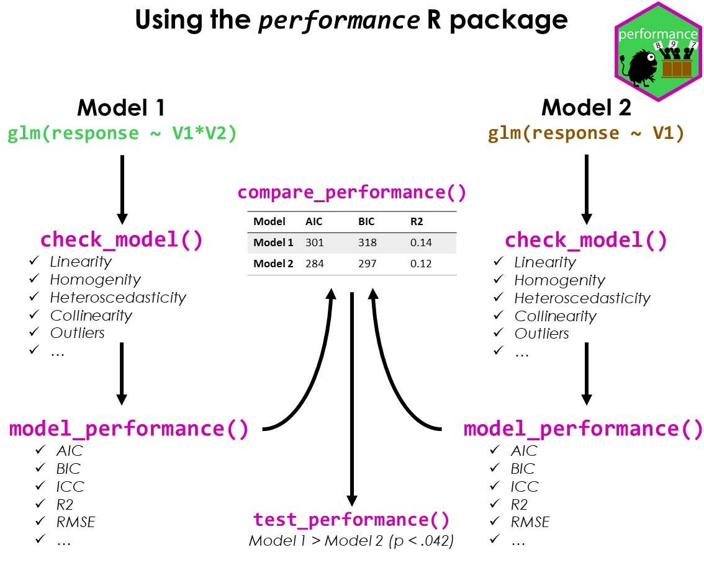

```{r , include=FALSE}
library(knitr)
knitr::opts_chunk$set(
  dpi = 300,
  fig.width = 7,
  fig.height = 5,
  out.width = "100%",
  out.height = "100%",
  collapse = TRUE,
  comment = "#>",
  warning = FALSE,
  message = TRUE
)
options(knitr.kable.NA = "")
options(digits = 2)

pkgs <- c("DHARMa", "glmmTMB", "see", "parameters")
successfully_loaded <- vapply(pkgs, requireNamespace, FUN.VALUE = logical(1L), quietly = TRUE)
can_evaluate <- all(successfully_loaded)

if (can_evaluate) {
  knitr::opts_chunk$set(eval = TRUE)
  vapply(pkgs, require, FUN.VALUE = logical(1L), quietly = TRUE, character.only = TRUE)
} else {
  knitr::opts_chunk$set(eval = FALSE)
}
```

This vignette shows how to use the [*performance* package](https://easystats.github.io/performance) to check the fit of a model, how to detect misspecification and how to improve your model. The basic workflow of the *performance* package can be summarized as follows:

- fit a regression model
- check the model fit and assess model fit indices
- if necessary, fit another model that could potentially improve the fit
- compare the model fit indices and perform statistical tests to determine which model is the best fit

{width="75%"}

In the following, we will demonstrate this workflow using a model with a count response variable. We will fit a Poisson regression model to the Salamanders dataset from the *glmmTMB* package. The dataset contains counts of salamanders in different sites, along with information on the number of mines and the species of salamanders. We will check the model fit and assess the model fit indices.

Problems that may arise with count response variables are _zero inflation_ and _overdispersion_. Zero inflation occurs when there are more zeros in the data than expected under the Poisson distribution. Overdispersion occurs when the variance of the data is greater than the mean, which violates the assumption of equidispersion in the Poisson distribution.

We will check for these problems and suggest ways to improve the model fit, i.e. if necessary, we will fit another model that could potentially improve the fit. Finally, we will compare the model fit indices and perform statistical tests to determine which model is the best fit.

## Fit the initial model

We start with a generalized mixed effects model, using a Poisson distribution.

```{r}
library(performance)
model1 <- glmmTMB::glmmTMB(
  count ~ mined + spp + (1 | site),
  family = poisson,
  data = glmmTMB::Salamanders
)
```

First, let us look at the summary of the model.

```{r}
library(parameters)
model_parameters(model1)
```

We see a lot of statistically significant estimates here. No matter, which [philosophy](https://easystats.github.io/parameters/reference/p_function.html) you follow in terms of interpreting statistical test results, our conclusions we draw from our regression models will be inaccurate if our modeling assumptions are a poor fit for the situation. Hence, checking model fit is essential.

In *performance*, we can conduct a comprehensive visual inspection of our model fit using `check_model()`. We won't go into details of all the plots here, but you can find more information on all created diagnostic plots in the [dedicated vignette](https://easystats.github.io/performance/articles/check_model.html).

For now, we want to focus on the _posterior predictive checks_, _dispersion and zero-inflation_ as well as the Q-Q plot (_uniformity of residuals_).

```{r fig.height=12, fig.width=10}
check_model(model1)
```

Note that unlike `plot()`, which is a base R function to create diagnostic plots, `check_model()` relies on *simulated residuals* for the Q-Q plot, which is more accurate for non-Gaussian models. See [this vignette](https://easystats.github.io/performance/articles/simulate_residuals.html) and the documentation of `simulate_residuals()` for further details.

The above plot suggests that we may have issues with overdispersion and/or zero-inflation. We can check for these problems using `check_overdispersion()` and `check_zeroinflation()`, which will perform statistical tests (based on simulated residuals). These tests can additionally be used beyond the visual inspection.

```{r}
check_overdispersion(model1)

check_zeroinflation(model1)
```

As we can see, our model seems to suffer both from overdispersion and zero-inflation.

## First attempt at improving the model fit

We can try to improve the model fit by fitting a model with zero-inflation component:

```{r fig.height=12, fig.width=10}
model2 <- glmmTMB::glmmTMB(
  count ~ mined + spp + (1 | site),
  ziformula = ~ mined + spp,
  family = poisson,
  data = glmmTMB::Salamanders
)
check_model(model2)
```

Looking at the above plots, the zero-inflation seems to be addressed properly (see especially _posterior predictive checks_ and _uniformity of residuals_, the Q-Q plot). However, the overdispersion still could be present. We can check for these problems using `check_overdispersion()` and `check_zeroinflation()` again.

```{r}
check_overdispersion(model2)

check_zeroinflation(model2)
```

Indeed, the overdispersion is still present.

## Second attempt at improving the model fit

We can try to address this issue by fitting a negative binomial model instead of using a Poisson distribution.

```{r fig.height=12, fig.width=10}
model3 <- glmmTMB::glmmTMB(
  count ~ mined + spp + (1 | site),
  ziformula = ~ mined + spp,
  family = glmmTMB::nbinom1,
  data = glmmTMB::Salamanders
)
check_model(model3)
```

Now we see that the plot showing _misspecified dispersion and zero-inflation_ suggests that the overdispersion is better addressed than before. Let us check again:

```{r}
check_overdispersion(model3)

check_zeroinflation(model3)
```

## Comparing model fit indices

There are different model fit indices that can be used to compare models. For our purpose, we rely on the Akaike Information Criterion (AIC), the corrected Akaike Information Criterion (AICc), the Bayesian Information Criterion (BIC), and the Proper Scoring Rules. We can compare the models using `compare_performance()` and `plot()`.

```{r}
result <- compare_performance(
  model1, model2, model3,
  metrics = c("AIC", "AICc", "BIC", "SCORE")
)
result

plot(result)
```

The weighted AIC and BIC range from 0 to 1, indicating better model fit the closer the value is to 1. The AICc is a corrected version of the AIC for small sample sizes. The Proper Scoring Rules range from -Inf to 0, with higher values (i.e. closer to 0) indicating better model fit.

The above results suggest that indeed our third model is the best fit.

## Statistical tests for model comparison

We can also perform statistical tests to determine which model is the best fit using `test_performance()` or `anova()`. `test_performance()` automatically selects an appropriate test based on the model family. You can also call the different tests, like `test_likelihoodratio()`, `test_bf()`, `test_wald()` or `test_vuong()` directly.

```{r}
test_performance(model1, model2, model3)
```

We see, first, that `test_performance()` used the Bayes factor (based on BIC comparison) to compare the models. And second, that both the second and third model seem to be significantly better than the first model.

Now we compare the second against the third model
```{r}
test_performance(model2, model3)

test_likelihoodratio(model2, model3)
```

We see that both the Bayes factor and likelihood ratio test suggest that the third model is significantly better than the second model.

What does this mean for our inference?

```{r}
model_parameters(model3)
```

Obviously, although we might have found the best fitting model, coefficients for the _zero-inflation_ component of our model look rather spurious. We have *very* high coefficients here. We still might find a better distributional family for our model, and try `nbinom2` now.

```{r fig.height=12, fig.width=10}
model4 <- glmmTMB::glmmTMB(
  count ~ mined + spp + (1 | site),
  ziformula = ~ mined + spp,
  family = glmmTMB::nbinom2,
  data = glmmTMB::Salamanders
)
check_model(model4)

check_overdispersion(model4)

check_zeroinflation(model4)

test_likelihoodratio(model3, model4)

model_parameters(model4)
```

Based on these results, we might even go with `model4`.

# Conclusion

Statistics is hard. It is not just about fitting a model, but also about checking the model fit and improving the model. This also requires domain knowledge to consider whether all relevant predictors are included in the model (and whether all included predictors are relevant!).

The *performance* package provides a comprehensive set of tools to help you with this task. We have demonstrated how to use these tools to check the fit of a model, detect misspecification, and improve the model. We have also shown how to compare the model fit indices and perform statistical tests to determine which model is the best fit. We hope this vignette has been helpful in guiding you through this process.

